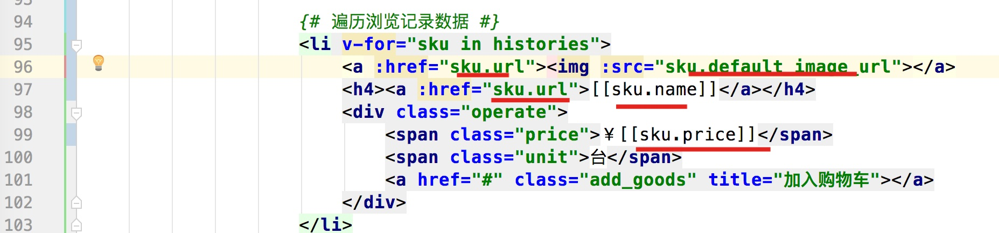
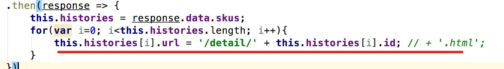
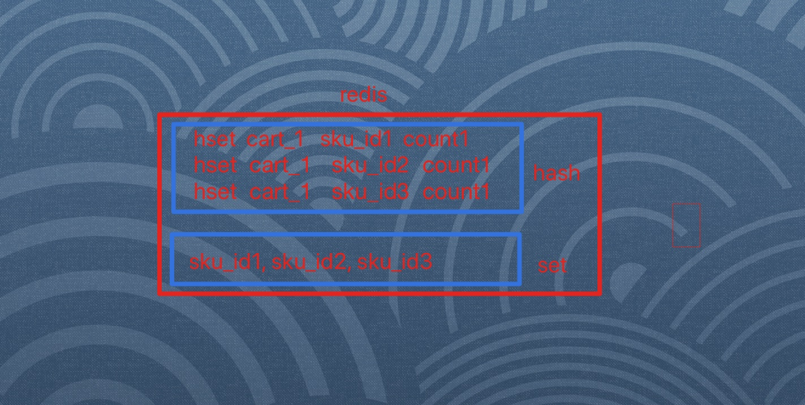
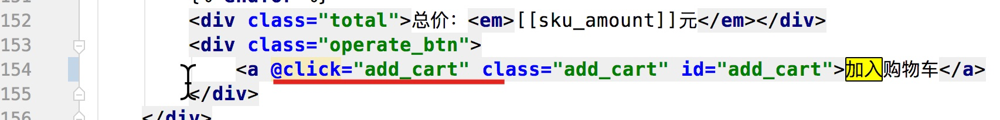
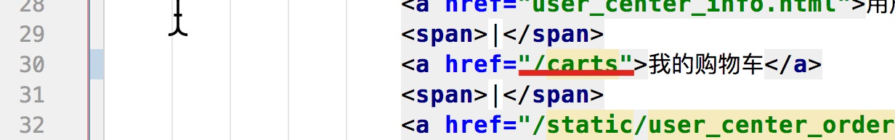

#### 1,浏览记录存储结构说明

- 设计思路:
  - 保存用户浏览记录:   选取的redis
  - 选用redis的数据类型: list

#### 2,redis补充

- 目的: 能够使用hash,list,set类型做数据的增删改查
- hash: hset, hget, hgetall, hincrby, hdel
  - hset: 设置
  - hget; 获取
  - hgetall: 获取所有数据,键值对格式
  - hincrby: 累加,或者新增
  - hdel: 删除
- list: lpush, lrange, lrem, ltrim
  - lpush : 推入数据
  - lrange: 获取数据
  - lrem: 删除数据
    - lrem key count value
      - count: 为0, 删全部value
      - count: 为负数, 从后面开始删value
      - count: 为正数, 从前面开始删value
  - ltrim: 截取
- set: sadd, smembers, srem
  - sadd: 添加数据
  - smembers: 获取数据
  - srem: 删除数据

#### 3,保存浏览记录

- 目的: 保存用户的浏览记录到redis中

- 操作流程:

  - 1, 子路由

    ```python
    url(r'^browse_histories/$',views.UserBrowserHistoryView.as_view()),
    ```

    

  - 2,类视图

    ```python
    class UserBrowserHistoryView(MyLoginRequiredMiXinView):
        def post(self,request):
            #1,获取参数
            dict_data = json.loads(request.body.decode())
            sku_id = dict_data.get("sku_id")
            user = request.user
    
            #2,校验参数
            if not sku_id:
                return http.HttpResponseForbidden("参数不全")
    
            try:
                sku = SKU.objects.get(id=sku_id)
            except Exception as e:
                return http.HttpResponseForbidden("商品不存在")
    
            #3,数据入库(redis)
            redis_conn = get_redis_connection("history")
            pipeline = redis_conn.pipeline()
            
            #3.1 去重
            pipeline.lrem("cart_%s"%user.id,0,sku_id)
    
            #3.2 存储
            pipeline.lpush("cart_%s"%user.id,sku_id)
    
            #3.3 截取
            pipeline.ltrim("cart_%s"%user.id,0,4)
            pipeline.execute()
    
            #4,返回响应
            return http.JsonResponse({"code":RET.OK,"errmsg":"ok"})
    ```

    

  - 3,redis配置

    ```python
        "history": {
            "BACKEND": "django_redis.cache.RedisCache",
            "LOCATION": "redis://127.0.0.1:6379/3",
            "OPTIONS": {
                "CLIENT_CLASS": "django_redis.client.DefaultClient",
            }
        },
    ```

  - 4,注意点:

    ```python
    var sku_id = {{ sku.id }};
    ```

    

#### 4,获取浏览记录

- 目的: 能够获取用户redis中的浏览数据,展示到个人中心

- 操作流程:

  - 1 ,类视图

    ```python
    class UserBrowserHistoryView(MyLoginRequiredMiXinView):
        def post(self,request):
           ...
    
        def get(self,request):
            #1,获取redis中的数据
            redis_conn = get_redis_connection("history")
            sku_ids = redis_conn.lrange("history_%s"%request.user.id,0,4)
    
            #2,拼接数据
            sku_list = []
            for sku_id in sku_ids:
                sku = SKU.objects.get(id=sku_id)
                sku_dict = {
                    "id":sku.id,
                    "default_image_url":sku.default_image_url.url,
                    "name":sku.name,
                    "price":sku.price,
                }
                sku_list.append(sku_dict)
    
            #3,返回
            return http.JsonResponse({"skus":sku_list})
    ```

  - 2, 模板渲染

    

  - 3,js代码url拼接

    

    

#### 5,购物车存储设计

- 存储分析

  - 登陆用户

    - 存储在: redis
    - 存储的类型: hash, set
    - hash: 存放所有的购物车的数据
    - set: 存放需要结算的商品
    - 

  - 未登录用户

    - 存储在: cookie

    - 格式:

      ```python
      {
        sku_id1:{
          "count":10,
          "selected":True
        },
        sku_id2:{
          "count":10,
          "selected":True
        }
        ...
        
      }
      ```

#### 6,pickle

- 目的: 能够使用pickle将字符串(字典)和二进制数据之间进行相互转换

- 两个方法:

  - bytes8 = pickle.dumps(dict)

  - dict =  pickle.loads(bytes8)

  - 代码展示:

    ```python
    In [3]: import pickle                                                                                                                                 
    
    In [4]: a = pickle.dumps({"name":"zhangsan"})                                                                                                                      
    
    In [5]: a                                                                                                                                                          
    Out[5]: b'\x80\x03}q\x00X\x04\x00\x00\x00nameq\x01X\x08\x00\x00\x00zhangsanq\x02s.'
    
    In [6]: b = pickle.loads(a)                                                                                                                                        
    
    In [7]: b                                                                                                                                                          
    Out[7]: {'name': 'zhangsan'}
    
    ```

    

#### 7,base64

- 目的: 是一种编码方式, 用来将8位的2进制数据, 和6位2进制数据之间进行相互转换

- 两个方法:

  - byte6 = base64.b64encode(byte8)

  - byte8 = base64.b64decode(byte6)

  - 代码表示:

    ```python
    In [3]: import pickle                                                                                                                                              
    
    In [4]: a = pickle.dumps({"name":"zhangsan"})                                                                                                                      
    
    In [5]: a                                                                                                                                                          
    Out[5]: b'\x80\x03}q\x00X\x04\x00\x00\x00nameq\x01X\x08\x00\x00\x00zhangsanq\x02s.'
    
    In [6]: b = pickle.loads(a)                                                                                                                                        
    
    In [7]: b                                                                                                                                                          
    Out[7]: {'name': 'zhangsan'}
    
    In [8]: import base64                                                                                                                                              
    
    In [9]: c = base64.b64encode(a)                                                                                                                                    
    
    In [10]: c                                                                                                                                                         
    Out[10]: b'gAN9cQBYBAAAAG5hbWVxAVgIAAAAemhhbmdzYW5xAnMu'
    
    In [11]: d = base64.b64decode(c)                                                                                                                                   
    
    In [12]: d                                                                                                                                                         
    Out[12]: b'\x80\x03}q\x00X\x04\x00\x00\x00nameq\x01X\x08\x00\x00\x00zhangsanq\x02s.'
    
    In [13]: "name".encode()                                                                                                                                           
    Out[13]: b'name'
    
    In [14]: b'name'.decode()                                                                                                                                          
    Out[14]: 'name'
    
    
    ```

    

#### 8,添加购物车-类视图

- 目的: 能够编写类视图处理购物车校验的逻辑

- 操作流程:

  - 0,创建carts子应用

  - 1,根应用

    ```python
    url(r'^', include('carts.urls')),
    ```

  - 2,子应用

    ```python
    url(r'^carts/$',views.CartView.as_view())
    ```

  - 3,类视图

    ```python
    class CartView(View):
        def post(self,request):
            #1,获取参数
            dict_data = json.loads(request.body.decode())
            sku_id = dict_data.get("sku_id")
            count = dict_data.get("count")
            selected = dict_data.get("selected",True)
            user = request.user
    
            #2,校验参数
            #2.1为空校验
            if not all([sku_id,count]):
                return http.HttpResponseForbidden("参数不全")
    
            #2.2判断count是否是整数
            try:
                count = int(count)
            except Exception as e:
                return http.HttpResponseForbidden("购买的数量错误")
    
            #2,2校验商品对象是否存在
            try:
                sku = SKU.objects.get(id=sku_id)
            except Exception as e:
                return http.HttpResponseForbidden("商品不存在")
    
            #2,3校验库存是否充足
            if count > sku.stock:
                return http.HttpResponseForbidden("库存不足")
    
            #3,判断用户状态
            if user.is_authenticated:
    
                pass
            else:
                pass
    
    ```

#### 9,添加购物车-登陆用户

- 目的: 能够将登陆用户的数据添加到redis中

- 操作流程:

  - 1, 类视图

    ```python
    class CartView(View):
        def post(self,request):
          	...
            #3,判断用户状态
            if user.is_authenticated:
                #3,1获取redis对象
                redis_conn = get_redis_connection("cart")
    
                #3,2添加数据到redis
                redis_conn.hincrby("cart_%s"%user.id,sku_id,count)
    
                if selected:
                    redis_conn.sadd("cart_selected_%s"%user.id,sku_id)
    
                #3,返回响应
                return http.JsonResponse({"code":RET.OK})
            else:
                pass
    
    ```

    

  - 2, 前端点击代码添加

  - 

#### 10,添加购物车-未登陆用户

- 目的: 能够将未登录用户的数据添加到cookie中

- 操作流程:

  - 1, 类视图

    ```python
    class CartView(View):
        def post(self,request):
            ...
            else:
                #4,1获取cookie中的购物车数据
                cookie_cart = request.COOKIES.get("cart")
    
                #4,2判断,转换成字典
                cookie_dict = {}
                if cookie_cart:
                    cookie_dict = pickle.loads(base64.b64decode(cookie_cart.encode()))
    
                #4,3累加count
                if sku_id in cookie_dict:
                    count += cookie_dict[sku_id].get("count",0)
    
                #4,4设置新的数据
                cookie_dict[sku_id] = {
                    "count":count,
                    "selected":selected
                }
    
                #4,5设置cookie,返回响应
                response = http.JsonResponse({"code": RET.OK})
                cookie_cart = base64.b64encode(pickle.dumps(cookie_dict)).decode()
                response.set_cookie("cart",cookie_cart)
    
                return response
    
    ```

    

#### 11,展示购物车界面

- 目的: 能够编写视图展示购物车界面

- 操作流程:

  - 1, 前端detail.html中添加跳转

    

  - 2,类视图

    ```python
    class CartView(View)
    	...
          def get(self,request):
    
            return render(request,'cart.html')
    ```

    

#### 12,获取购物车-登陆用户

- 目的: 能够将登陆用户的购物车信息展示出来

- 操作流程:

  - 1, 类视图

    ```python
        def get(self,request):
    
            #1,判断用户登陆状态
            user = request.user
            if user.is_authenticated:
                #1,获取redis数据
                redis_conn = get_redis_connection("cart")
                cart_dict = redis_conn.hgetall("cart_%s"%user.id)
                cart_selected_list = redis_conn.smembers("cart_selected_%s"%user.id)
    
                #2,拼接数据
                sku_list = []
                for sku_id,count in cart_dict.items():
                    sku = SKU.objects.get(id=sku_id)
                    sku_dict = {
                        "default_image_url":sku.default_image_url.url,
                        "name":sku.name,
                        "price":str(sku.price),
                        "amount":str(sku.price * int(count)),
                        "selected": str(sku_id in cart_selected_list),
                        "count":int(count)
                    }
                    sku_list.append(sku_dict)
    
                context = {
                    "sku_carts":sku_list
                }
                #3,返回响应
                return render(request,'cart.html',context=context)
                pass
            else:
                pass
    ```

    

  - 2, 模板代码直接拷贝使用

#### 13,获取购物车-未登陆用户

- 目的: 能够获取未登录用户的购物车数据

- 操作流程:

  - 1, 类视图

    ```python
        def get(self,request):
    				...
            else:
                #4,获取cookie中的数据
                cookie_cart = request.COOKIES.get("cart")
                
                if not cookie_cart:
                    return render(request,'detail.html')
                
                #5,数据转换
                cookie_dict = pickle.loads(base64.b64decode(cookie_cart.encode()))
                sku_list = []
    
                for sku_id,count_selected in cookie_dict.items():
                    sku = SKU.objects.get(id=sku_id)
                    sku_dict = {
                        "default_image_url": sku.default_image_url.url,
                        "name": sku.name,
                        "price": str(sku.price),
                        "amount": str(sku.price 
                                      * int(count_selected["count"])),
                        "selected": str(count_selected["selected"]),
                        "count": int(count_selected["count"])
                    }
                    sku_list.append(sku_dict)
                
                #6,返回响应
                context = {
                    "sku_carts": sku_list
                }
                # 3,返回响应
                return render(request, 'cart.html', context=context)
    ```

    

