#### 1,列表页分页,数据渲染

- 目的: 能够使用paginator显示列表页的数据

- 操作流程:

  - 1 ,类视图(goods/views.py)

    ```python
    class SkuListView(View):
        def get(self,request,category_id,page_num):
       			...
            #3,分页查询
            skus = SKU.objects.filter(category_id=category_id).order_by("-create_time")
            paginator = Paginator(object_list=skus,per_page=5) #创建分类对象,每页5条
            page = paginator.page(page_num)# 获取page_num页
            skus_list = page.object_list #获取page_num中的所有的对象
            current_page = page.number #当前页
            total_page = paginator.num_pages #总结
    
    
            #拼接数据,返回响应
            context = {
                ...
                "skus_list":skus_list,
                "current_page":current_page,
                "total_page":total_page
            }
    
            return render(request,'list.html',context=context)
    
    ```

  - 2, 前端页面

    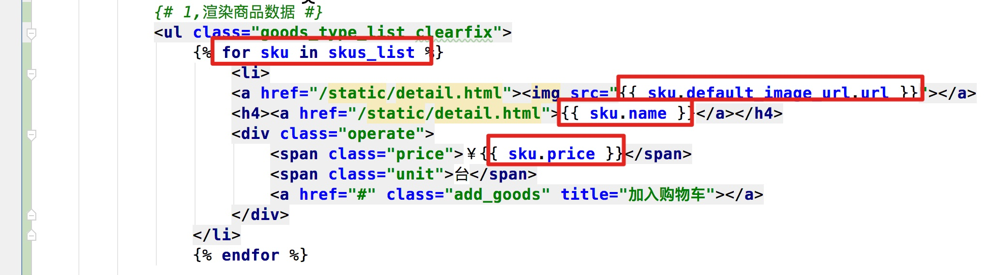

  - 3,前端js代码

    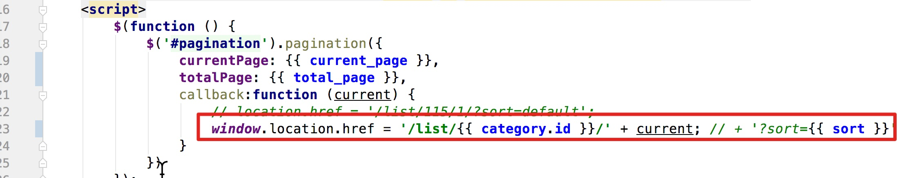

    

#### 2, 列表数据过滤排行

- 目的: 实现对应字段的过滤

- 操作流程:

  - 1, 类视图(goods/views.py)

    ```python
    class SkuListView(View):
        def get(self,request,category_id,page_num):
    
            #1,获取分类信息,获取参数
            categories = get_categories()
            sort = request.GET.get("sort","default") # 改动
    
            #1.1 根据sort设置排序方式  #改动
            if sort == "price":
                sort_field = "-price"
                sort = "price"
            elif sort == "hot":
                sort_field = "-sales"
                sort = "hot"
            else:
                sort_field = "-create_time"
                sort = "default"
    
    
            #2,获取分类对象
            category = GoodsCategory.objects.get(id=category_id)
    
    
            #3,分页查询 #改动
            skus = SKU.objects.filter(category_id=category_id).order_by(sort_field)
            paginator = Paginator(object_list=skus,per_page=5) #创建分类对象,每页5条
           ...
            #拼接数据,返回响应
            context = {
                ...
                "sort":sort #改动
            }
    
            return render(request,'list.html',context=context)
    ```

  - 2, 前端页面

    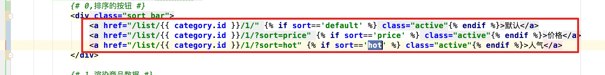

#### 3,列表页热销排行

- 目的: 能够编写类视图根据销量获取热门商品数据展示

- 操作流程:

  - 1, 子路由(goods/ulrs.py)

    ```python
    url(r'^hot/(?P<category_id>\d+)/$',views.HotSkuListView.as_view()),
    ```

  - 2, 类视图(goods/views.py)

    ```python
    class HotSkuListView(View):
        def get(self,request,category_id):
            #1,根据销量获取两个sku对象
            skus = SKU.objects.filter(category_id=category_id).order_by("-sales")[:3]
    
            #2,拼接数据
            hot_sku_list = []
            for sku in skus:
                sku_dict = {
                    "id":sku.id,
                    "default_image_url":sku.default_image_url.url,
                    "name":sku.name,
                    "price":sku.price
                }
                hot_sku_list.append(sku_dict)
    
    
            #3,返回响应
            return http.JsonResponse({"hot_sku_list":hot_sku_list})
    ```

  - 3,前端模板代码(list.html)

    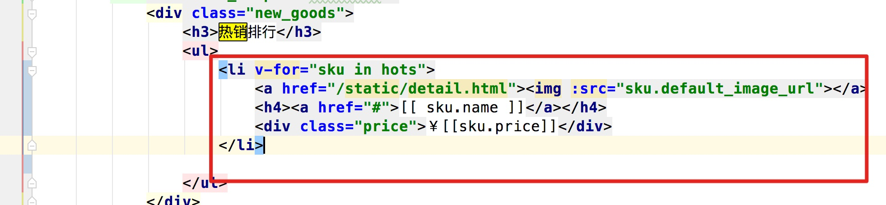

- 注意点:

  - 注意点vue中获取了category_id的值,需要将其设置(解决vue语法报错)

    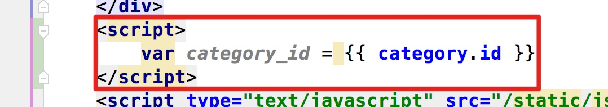

#### 4,ElaSticsearch介绍(见文档)

#### 5,ES安装(见文档)

- 目的: 能够下载镜像,并创建容器

- 操作流程:

  - 1,安装

    ```python
    $ sudo docker load -i elasticsearch-ik-2.4.6_docker.tar
    
    ```

  - 2,配置

    ```python
    修改/home/python/elasticsearc-2.4.6/config/elasticsearch.yml第54行。
    ```

  - 3,创建容器

    ```python
    $ sudo docker run -dti --name=elasticsearch --network=host -v /home/python/elasticsearch-2.4.6/config:/usr/share/elasticsearch/config delron/elasticsearch-ik:2.4.6-1.0
    
    ```

    

#### 6,Haystack(见文档)

#### 7,Haystack数据索引(操作)

- 目的: 能够参考文档,安装配置haystack

- 操作流程:

  - 1,安装

    ```python
    $ pip install django-haystack
    $ pip install elasticsearch==2.4.1
    ```

  - 2,注册

    ```python
    INSTALLED_APPS = [
        'haystack', # 全文检索
    ]
    ```

  - 3,配置

    ```python
    # Haystack
    HAYSTACK_CONNECTIONS = {
        'default': {
            'ENGINE': 'haystack.backends.elasticsearch_backend.ElasticsearchSearchEngine',
            'URL': 'http://192.168.103.158:9200/', # Elasticsearch服务器ip地址，端口号固定为9200
            'INDEX_NAME': 'meiduo_mall', # Elasticsearch建立的索引库的名称
        },
    }
    
    # 当添加、修改、删除数据时，自动生成索引
    HAYSTACK_SIGNAL_PROCESSOR = 'haystack.signals.RealtimeSignalProcessor'
    ```

  - 4,创建索引类

    ```python
    from haystack import indexes
    
    from .models import SKU
    
    
    class SKUIndex(indexes.SearchIndex, indexes.Indexable):
        """SKU索引数据模型类"""
        text = indexes.CharField(document=True, use_template=True)
    
        def get_model(self):
            """返回建立索引的模型类"""
            return SKU
    
        def index_queryset(self, using=None):
            """返回要建立索引的数据查询集"""
            return self.get_model().objects.filter(is_launched=True)
    ```

  - 5,模板配置

    ```python
    {{ object.id }}
    {{ object.name }}
    {{ object.price }}
    ```

  - 6,终端中构建索引

    ```python
    python manage.py  rebuild_index
    ```

  - 7,添加search.html到模板中(templates/search)

#### 7,数据展示

- 目的: 可以根据返回的内容渲染页面

- 操作流程:

  - 1, search.html中的模板代码

    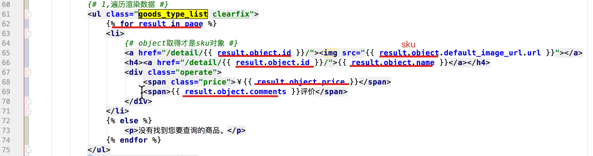

  - 2, search.html中的js代码

    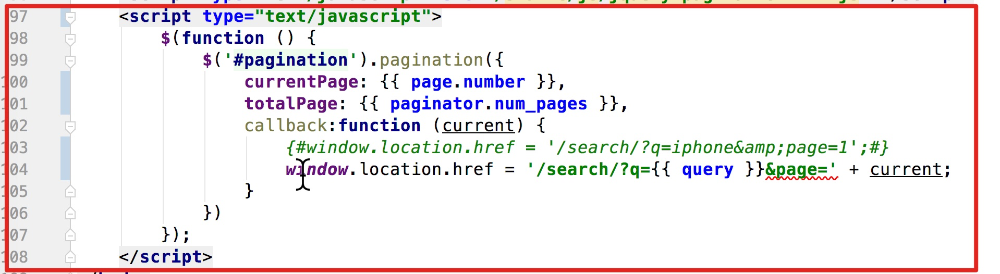

#### 8,详情页展示

- 目的: 可以渲染出商品详情页

- 操作流程:

  - 1, 路由(goods/urls)

    ```python
    url(r'^detail/(?P<sku_id>\d+)/$',views.SKUDetailView.as_view()),
    ```

  - 2,类视图(goods/views.py)

    ```python
    class SKUDetailView(View):
        def get(self,request,sku_id):
            return render(request,'detail.html')
    ```

  - 3,列表点击链接(list.html)

    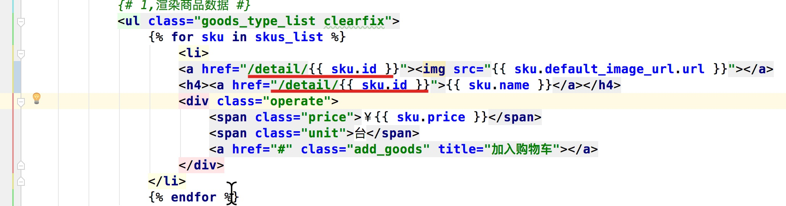

#### 9,详情页分类,面包屑

- 目的: 能够携带分类,面包屑数据,渲染页面

- 操作流程:

  - 1, 类视图

    ```python
    class SKUDetailView(View):
        def get(self,request,sku_id):
    
            #1,获取分类数据
            categories = get_categories()
    
            #2,获取面包屑数据
            category = get_crumbs(sku_id)
    
    
            #携带数据渲染页面
            context = {
                "categories":categories,
                "category":category
            }
    
            return render(request,'detail.html',context=context)
    ```

  - 2,detail.html模板页面

    - 分类渲染

    ```html
    <div class="sub_menu_con fl">
    				<h1 class="fl">商品分类</h1>
    				<ul class="sub_menu">
                
                <li>
                    <div class="level1">
                        
                        <a href="{{ channel.url }}">{{ channel.name }}</a>
                        
                    </div>
                    <div class="level2">
                        
                        <div class="list_group">
                            <div class="group_name fl">{{ cat2.name }} 
                              &gt;</div>
                            <div class="group_detail fl">
                                
                                <a href="/list/{{ cat3.id }}/1/">
                                  {{ cat3.name }}</a>
                                
                            </div>
                        </div>
                        
                    </div>
                </li>
                
            </ul>
    			</div>
    ```

    - 面包屑渲染

      ```html
          {# 面包屑数据 #}
      	<div class="breadcrumb">
      		<a href="http://shouji.jd.com/">
            {{ category.parent.parent.name }}</a>
      		<span>></span>
      		<a href="javascript:;">{{ category.parent.name }}</a>
              <span>></span>
      		<a href="javascript:;">{{ category.name }}</a>
      	</div>
      ```

      

#### 10,详情页商品信息

- 目的: 目的能够查询商品对象数据,渲染页面

- 操作步骤:
  - 1, 类视图(goods/views.py)

    ```python
    class SKUDetailView(View):
        def get(self,request,sku_id):
    				..
            #3,查询商品sku对象
            sku = SKU.objects.get(id=sku_id)
    
            #携带数据渲染页面
            context = {
                ...
                "sku":sku
            }
    
            return render(request,'detail.html',context=context)
    ```

    

  - 2,前端模板(detail.html)

    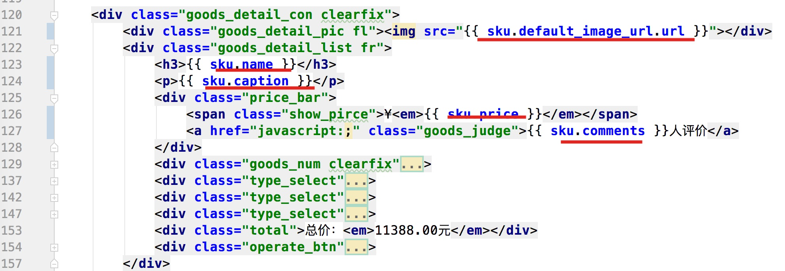

- 注意点:
  - 1, 当前后端返回的是render(…,context={}), 那么前端使用jinja2模板语法
  - 2, 当后端会的是http.JsonResponse({context:xx}),那么前端使用vue渲染数据


#### 11,商品总价计算

- 操作流程:

  - 1, detial.html代码格式

    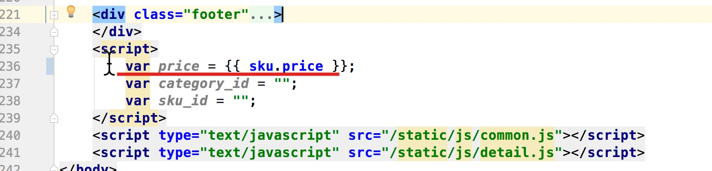

    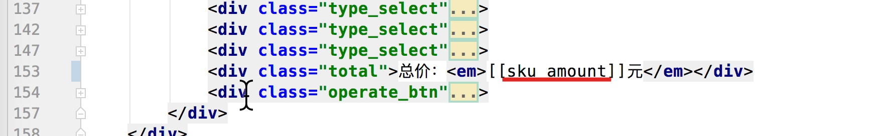

#### 12,规格信息渲染(理解)

- 目的: 理解格式拼接

  - 1, 类视图

    ```python
    class SKUDetailView(View):
        def get(self,request,sku_id):
    				...
            
            #4,商品sku规格信息
            # 构建当前商品的规格键
            sku_specs = sku.specs.order_by('spec_id')
            sku_key = []
            for spec in sku_specs:
                sku_key.append(spec.option.id)
            # 获取当前商品的所有SKU
            skus = sku.spu.sku_set.all()
            # 构建不同规格参数（选项）的sku字典
            spec_sku_map = {}
            for s in skus:
                # 获取sku的规格参数
                s_specs = s.specs.order_by('spec_id')
                # 用于形成规格参数-sku字典的键
                key = []
                for spec in s_specs:
                    key.append(spec.option.id)
                # 向规格参数-sku字典添加记录
                spec_sku_map[tuple(key)] = s.id
            # 获取当前商品的规格信息
            goods_specs = sku.spu.specs.order_by('id')
            # 若当前sku的规格信息不完整，则不再继续
            if len(sku_key) < len(goods_specs):
                return
            for index, spec in enumerate(goods_specs):
                # 复制当前sku的规格键
                key = sku_key[:]
                # 该规格的选项
                spec_options = spec.options.all()
                for option in spec_options:
                    # 在规格参数sku字典中查找符合当前规格的sku
                    key[index] = option.id
                    option.sku_id = spec_sku_map.get(tuple(key))
                spec.spec_options = spec_options
    
            #携带数据渲染页面
            context = {
                ...
                "specs":goods_specs
            }
    
            return render(request,'detail.html',context=context)
    ```

    

  - 2,前端代码渲染

    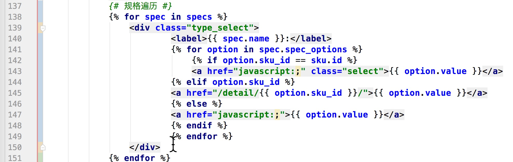

#### 13,商品详情,规格包装,售后服务

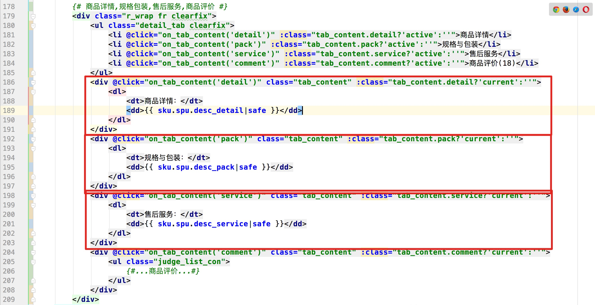

#### 14,统计分类商品访问量模型类

- 目的: 通过访问数量表分析, 编写出对应的模型类

- 操作流程 :

  - 1, 模型类(goods/models.py)

    ```python
    class GoodVisitCount(BaseModel):
        category = models.ForeignKey(GoodsCategory,related_name="visit_counts",on_delete=models.CASCADE,verbose_name="分类")
        date = models.DateField(auto_now_add=True,verbose_name="访问的日期")
        count = models.IntegerField(default=0,verbose_name="数量")
    
        class Meta:
            db_table = "tb_goods_visit"
    ```

  - 2,迁移

#### 15,获取当天时间

- 目的: 能够获取当前时间对象

  ```python
  In [1]: import time                                                                                                                                                
  
  In [2]: local_time = time.localtime()                                                                                                                              
  
  In [3]: local_time                                                                                                                                                 
  Out[3]: time.struct_time(tm_year=2019, tm_mon=6, tm_mday=2, tm_hour=11, tm_min=45, tm_sec=43, tm_wday=6, tm_yday=153, tm_isdst=0)
  
  In [4]: local_time.tm_year                                                                                                                                         
  Out[4]: 2019
  
  In [5]: local_time.tm_mon                                                                                                                                          
  Out[5]: 6
  
  In [6]: from datetime import datetime                                                                                                                              
  
  In [7]: #1,获取当天的时间字符串                                                                                                                                    
  
  In [8]: current_str = "%d-%02d-%02d"%(local_time.tm_year,local_time.tm_mon,local_time.tm_mday)                                                                     
  
  In [9]: current_str                                                                                                                                                
  Out[9]: '2019-06-02'
  
  In [10]: #2,将当天的时间字符串转成日期对象                                                                                                                         
  
  In [11]: current_date = datetime.strptime(current_str,'%Y-%m-%d')                                                                                                  
  
  In [12]: current_date                                                                                                                                              
  Out[12]: datetime.datetime(2019, 6, 2, 0, 0)
  
  In [13]: current_str2 = '2019-06-03'                                                                                                                               
  
  In [14]: current_date2 = datetime.strptime(current_str2,'%Y-%m-%d')                                                                                                
  
  In [15]: current_date < current_date2                                                                                                                              
  Out[15]: True
  
  In [16]: current_date > current_date2                                                                                                                              
  Out[16]: False
  
  ```

  

#### 16,分类访问量类视图

- 目的: 能够编写类视图,设置分类商品的访问量

- 操作流程:

  - 1, 子路由(goods/urls.py)

    ```python
    url(r'^detail/visit/(?P<category_id>\d+)/$',views.GoodsVisitView.as_view()),
    ```

  - 2,类视图(goods/views.py)

    ```python
    class GoodsVisitView(View):
        def post(self,request,category_id):
            #1,获取分类对象
            try:
                category = GoodsCategory.objects.get(id=category_id)
            except Exception as e:
                return http.HttpResponseForbidden("分类不存在")
    
            #2,获取当天时间
            local_time = time.localtime()
            current_str = "%d-%02d-%02d"%(local_time.tm_year,local_time.tm_mon,local_time.tm_mday)
            current_date = datetime.strptime(current_str,"%Y-%m-%d")
    
            #3,获取分类对象中的访问数量
            try:
                visit_count = category.visit_counts.get(date=current_date)
            except Exception as e:
                visit_count = GoodVisitCount()
    
            #4,设置访问对象的属性
            visit_count.category_id = category_id
            visit_count.date = current_date
            visit_count.count += 1
    
            #5,数据入库
            visit_count.save()
    
            #4,返回响应
            return http.JsonResponse({"code":RET.OK,"errmsg":"success"})
    ```

  - 3,前端代码(detail.html)

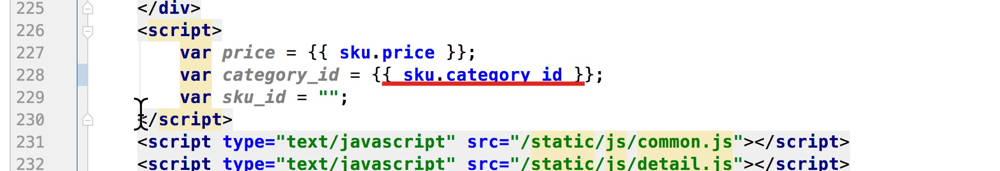