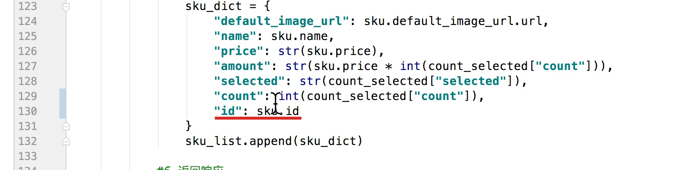
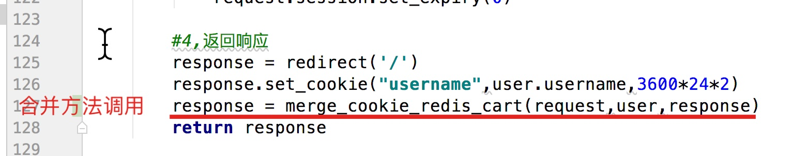
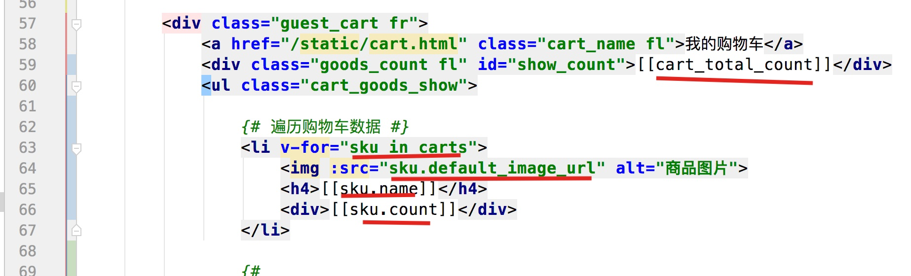
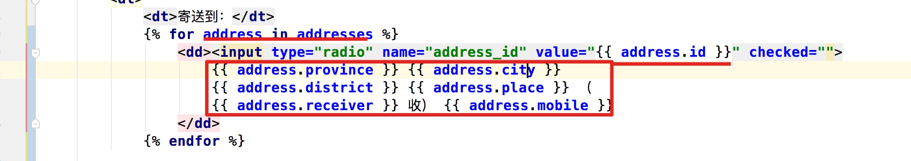

#### 1,修改购物车类视图

- 目的: 能够编写修改购物车的类视图方法

- 操作流程:

  - 1,类视图中put方法

    ```python
        def put(self,request):
            #1,获取参数
            dict_data = json.loads(request.body.decode())
            sku_id = dict_data.get("sku_id")
            count = dict_data.get("count")
            selected = dict_data.get("selected",True)
    
            #2,校验参数
            #2.1 为空校验
            if not all([sku_id,count]):
                return http.HttpResponseForbidden("参数不全")
    
            #2.2 sku_id对应的商品对象是否存在
            try:
                sku = SKU.objects.get(id=sku_id)
            except Exception as e:
                return http.HttpResponseForbidden('商品不存在')
    
            #2.3 将count整数化
            try:
                count = int(count)
            except Exception as e:
                return http.HttpResponseForbidden('count数量有误')
    
            #3,判断用户状态
            user = request.user
            if user.is_authenticated:
                pass
            else:
    ```

    

#### 2,修改购物车(登陆)

- 目的: 能够修改用户redis中的数据

- 操作流程:

  - 1, 获取购物车数据的时候需要带上id

    

  - 2,类视图中用户登陆redis数据修改

    ```python
    class CartView(View):
    	def put(self,request):
        ...
        if user.is_authenticated:
                #3.1 获取redis对象
                redis_conn = get_redis_connection("cart")
    
                #3.2 修改数据
                redis_conn.hset("cart_%s"%user.id,sku_id,count)
    
                if selected:
                    redis_conn.sadd("cart_selected_%s"%user.id,sku_id)
                else:
                    redis_conn.srem("cart_selected_%s" % user.id, sku_id)
    
                #3.3 拼接数据返回响应
                context = {
                    "code":RET.OK,
                    "cart_sku":{
                        "default_image_url": sku.default_image_url.url,
                        "name": sku.name,
                        "price": str(sku.price),
                        "amount": str(sku.price * count),
                        "selected": str(selected),
                        "count": int(count),
                        "id": sku.id
                    }
                }
                return http.JsonResponse(context)
            else:
                pass
    
    ```

#### 3,修改购物车(未登陆)

- 目的: 能够修改未登录用户的cookie中的数据

- 操作流程:

- 1,类视图,put方法

  ```Python
  def put(self,request):   
    			....
    			else:
              #4.1 获取cookie中数据
              cookie_cart = request.COOKIES.get("cart")
  
              #4.2 字典转换
              cookie_dict = {}
              if cookie_cart:
                  cookie_dict = pickle.loads(
                    base64.b64decode(cookie_cart.encode()))
  
              #4.3 修改
              cookie_dict[sku_id] = {
                  "count":count,
                  "selected":selected
              }
  
              #4.4 转换并返回
              context = {
                  "code": RET.OK,
                  "cart_sku": {
                      "default_image_url": sku.default_image_url.url,
                      "name": sku.name,
                      "price": str(sku.price),
                      "amount": str(sku.price * count),
                      "selected": selected,
                      "count": int(count),
                      "id": sku.id
                  }
              }
              response = http.JsonResponse(context)
              cookie_cart = base64.b64encode(pickle.dumps(cookie_dict)).decode()
              response.set_cookie("cart",cookie_cart)
              return response
  
  ```

- 注意点:

  - 响应数据的时候,由于前端没有对selected数据做处理,所以我们需要返回bool类型

#### 4,删除购物车(登陆)

- 目的: 能够删除rdis中的数据

- 操作流程:

  - 1,类视图delete方法

    ```python
        def delete(self,request):
            #1,获取参数
            dict_data = json.loads(request.body.decode())
            sku_id = dict_data.get("sku_id")
    
            #2,校验参数
            #2.1 为空校验
            if not sku_id:
                return http.HttpResponseForbidden("参数不全")
    
            #2.2 sku_id对应的商品对象是否存在
            try:
                sku = SKU.objects.get(id=sku_id)
            except Exception as e:
                return http.HttpResponseForbidden('商品不存在')
    
            #3 判断用户登录状态
            user = request.user
            if user.is_authenticated:
                #3.3 获取redis对象
                redis_conn = get_redis_connection("cart")
                pipeline = redis_conn.pipeline()
    
                #3.3 删除数据
                pipeline.hdel("cart_%s"%user.id,sku_id)
                pipeline.srem("cart_selected_%s"%user.id,sku_id)
                pipeline.execute()
    
                #3.4 返回响应
                return http.JsonResponse({"code":RET.OK,"errmsg":"success"})
            else:
                pass
    ```

    

#### 5,删除购物车(未登陆)

- 目的: 能够删除cookie中购物车数据

- 操作流程:

  - 1, 类视图中的delete方法

    ```python
            else:
                #4.1获取cookie数据
                cookie_cart = request.COOKIES.get("cart")
    
                #4.2字典转换
                cookie_dict = {}
                if cookie_cart:
                    cookie_dict = pickle.loads(base64.b64decode(cookie_cart.encode()))
    
                #4.3删除数据
                if sku_id in cookie_dict:
                    del cookie_dict[sku_id]
    
                #4.4返回响应
                response = http.JsonResponse({"code":RET.OK,"errmsg":"success"})
                cookie_cart = base64.b64encode(pickle.dumps(cookie_dict)).decode()
                response.set_cookie("cart",cookie_cart)
                return response
    ```

    

#### 6,全选购物车(登陆)

- 目的: 能够全选reids中的数据

- 操作流程:

  - 1, 子路由(carts/urls.py)

    ```python
    url(r'^carts/selection/$',views.CartSelectedAllView.as_view()),
    ```

  - 2,类视图(carts/views.py)

    ```python
    class CartSelectedAllView(View):
        def put(self,request):
            #1,获取参数
            selected = json.loads(request.body.decode()).get("selected",True)
    
            #2,判断用户状态
            user = request.user
            if user.is_authenticated:
                #2.1获取redis对象,获取数据
                redis_conn = get_redis_connection("cart")
                cart_dict = redis_conn.hgetall("cart_%s"%user.id)
                sku_id_list = cart_dict.keys()
    
                #2.2全选数据
                if selected:
                    redis_conn.sadd("cart_selected_%s"%user.id,*sku_id_list)
                else:
                    redis_conn.srem("cart_selected_%s" % user.id, *sku_id_list)
    
                #2.3返回响应
                return http.JsonResponse({"code":RET.OK,"errmsg":"success"})
            else:
                pass
    ```

#### 7,全选购物车(未登陆)

- 目的: 全选cookie中的数据

- 操作流程:

- 1, 类视图:

  ```python
          else:
              #3.1 获取cookie中的数据
              cookie_cart = request.COOKIES.get("cart")
  
              #3.2 转换字典
              cookie_dict = {}
              if cookie_cart:
                  cookie_dict = pickle.loads(base64.b64decode(cookie_cart.encode()))
  
              #3.3 修改全选状态
              for sku_id in cookie_dict:
                  cookie_dict[sku_id]["selected"] = selected
  
              #3.4 返回响应
              response = http.JsonResponse({"code":RET.OK,"errmsg":"success"})
              cookie_cart = base64.b64encode(pickle.dumps(cookie_dict)).decode()
              response.set_cookie("cart",cookie_cart)
              return response
  ```

  

#### 8,合并购物车(美多用户)

- 目的: 能够将cookie的数据合并到redis中

- 操作流程:

  - 1,定义合并方法(carts/utils.py)

    ```python
    import pickle
    import base64
    from  django_redis import get_redis_connection
    def merge_cookie_redis_cart(request,user,response):
        """
        :param request: 为了获取cookie数据
        :param user: 为了获取redis数据
        :param response: 为了清空cookie数据
        :return:
        """
        #1,获取cookie数据
        cookie_cart = request.COOKIES.get("cart")
    
        #2,判断cookie是否存在,如果有转换
        if not cookie_cart:
            return response
    
        cookie_dict = {}
        if cookie_cart:
            cookie_dict = pickle.loads(base64.b64decode(cookie_cart.encode()))
    
        #3,合并数据
        redis_conn = get_redis_connection("cart")
        for sku_id, count_selected  in cookie_dict.items():
            redis_conn.hset("cart_%s"%user.id,sku_id,count_selected["count"])
    
            if count_selected["selected"]:
                redis_conn.sadd("cart_selected_%s"%user.id,sku_id)
            else:
                redis_conn.srem("cart_selected_%s" % user.id, sku_id)
    
        #4,清除cookie,返回响应
        response.delete_cookie("cart")
        return response
    ```

    

  - 2,登陆地方调用(users/views.py)

    

    

- 注意点:

  - 获取购物车页面的时候,如果cookie不存在,需要返回到cart.html

#### 9,合并购物车(qq用户)

- 目的: 能够通过qq登陆的用户合并购物车
- 操作流程:(oauth/views.py)
  - qq登陆成功3个位置, 调用merge方法

#### 10,购物车简要页面

- 目的: 能够编写购物车获取的类视图

- 操作流程:

  - 1, 子路由

    ```python
    url(r'^carts/simple/$',views.CartSimpleView.as_view()),
    ```

    

  - 2,类视图

    ```python
    class CartSimpleView(View):
        def get(self,request):
            pass
    ```

    

#### 11,购物车简要页面(登陆用户)

- 目的: 取出redis中的购物车数据

- 操作流程:

  - 1, 类视图

    ```python
    class CartSimpleView(View):
        def get(self,request):
    
            #1,判断用户状态
            user = request.user
    
            if user.is_authenticated:
                #2,1获取redis对象,取出数据
                redis_conn = get_redis_connection("cart")
                cart_dict = redis_conn.hgetall("cart_%s"%user.id)
    
                #2,2拼接数据
                sku_list = []
                for sku_id, count in cart_dict.items():
                    sku = SKU.objects.get(id=sku_id)
                    sku_dict = {
                        "id":sku.id,
                        "name":sku.name,
                        "default_image_url":sku.default_image_url.url,
                        "count":int(count)
                    }
                    sku_list.append(sku_dict)
    
                #2.3返回响应
                context = {
                    "cart_skus":sku_list
                }
                return http.JsonResponse(context)
            else:
                pass
    ```

    

  - 2,模板渲染

    

#### 12,购物车简要页面(未登陆用户)

- 目的: 能够展示cookie中的数据,到简要的购物车

- 操作流程:

  - 1, 类视图(carts/views.py)

    ```python
            else:
                #3.1 获取cookie数据
                cookie_cart = request.COOKIES.get("cart")
    
                #3.2字典转换
                cookie_dict = {}
                if cookie_cart:
                    cookie_dict = pickle.loads(base64.b64decode(cookie_cart.encode()))
    
                #3.3拼接数据
                sku_list = []
                for sku_id,count_selected in cookie_dict.items():
                    sku = SKU.objects.get(id=sku_id)
                    sku_dict = {
                        "id":sku.id,
                        "name":sku.name,
                        "default_image_url":sku.default_image_url.url,
                        "count":int(count_selected["count"])
                    }
                    sku_list.append(sku_dict)
    
                #3.4返回
                context = {
                    "cart_skus":sku_list
                }
                return http.JsonResponse(context)
    
    ```

    

#### 13,结算订单页展示

- 目的: 能够获取订单结算页面

- 操作流程:

  - 1,创建子应用

  - 2, 根路由

    ```python
    url(r'^', include('orders.urls')),
    ```

  - 3,子路由

    ```python
    url(r'^orders/settlement/$',views.OrderSettlementView.as_view())
    ```

  - 4,类视图

    ```python
    from django.shortcuts import render
    from django.views import View
    from meiduo_mall.utils.my_login_required import MyLoginRequiredMiXinView
    
    class OrderSettlementView(MyLoginRequiredMiXinView):
        def get(self,request):
            return render(request,'place_order.html')
    ```

####  14,结算订单页展示地址

- 目的: 能够获取用户的收货地址展示

- 操作流程:

  - 1, 类视图

    ```python
    class OrderSettlementView(MyLoginRequiredMiXinView):
        def get(self,request):
    
            #1,查询用户的地址
            try:
                addresses = request.user.addresses.filter(is_deleted=False).all()
            except Exception as e:
                addresses = None
    
    
            #2,拼接数据,返回响应
            context = {
                "addresses":addresses
            }
            return render(request,'place_order.html',context=context)
    
    ```

  - 2,模板渲染

    