#### 1,订单结算地址显示

- 目的: 当用户有多个地址的时候默认选中,用户的默认地址即可

- 操作流程:

  - 1, 渲染地址

    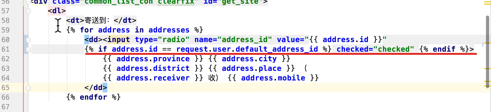

  - 2,终端测试手机号隐藏

    ```python
    In [1]: phone = '18210094342'                                                                                                                                      
    
    In [2]: list = phone[3:7]                                                                                                                                          
    
    In [3]: list                                                                                                                                                       
    Out[3]: '1009'
    
    In [4]: new_phone = phone.replace(list,'****')                                                                                                                     
    
    In [5]: new_phone                                                                                                                                                  
    Out[5]: '182****4342'
    
    ```

    

#### 2,订单结算商品显示

- 目的: 能够将购物车中选中的商品,展示在结算页面中

- 操作流程:

  - 1, 类视图(orders/views.py)

    ```python
    class OrderSettlementView(MyLoginRequiredMiXinView):
        def get(self,request):
            ...
            #3将商品的编号转换商品的数据
            sku_list = []
            #总数量,总金额
            total_count = 0
            total_amount = Decimal(0.0)
            for sku_id in cart_selected_list:
                sku = SKU.objects.get(id=sku_id)
                sku_dict = {
                    "id":sku.id,
                    "default_image_url":sku.default_image_url.url,
                    "name":sku.name,
                    "price":sku.price,
                    "count":int(cart_dict[sku_id]),
                    "amount":sku.price*int(cart_dict[sku_id])
                }
                sku_list.append(sku_dict)
    
                #累加
                total_count += int(cart_dict[sku_id])
                total_amount += (sku.price*int(cart_dict[sku_id]))
    
            #3,1运费,实付款
            freight = Decimal(10.0)
            payment_amount = total_amount+ freight
    
            #4,拼接数据,返回响应
            context = {
                "addresses":addresses,
                "skus":sku_list,
                "total_count":total_count,
                "total_amount":total_amount,
                "freight":freight,
                "payment_amount":payment_amount
            }
            return render(request,'place_order.html',context=context)
    ```

    

  - 2,页面渲染(palce_order.html)

    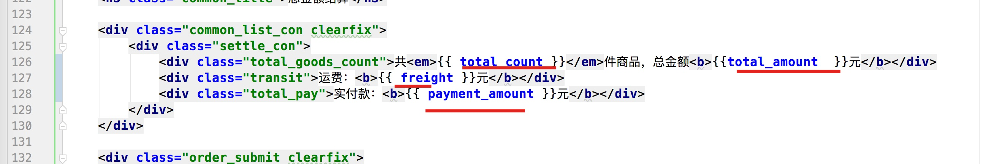

#### 3,订单表分析

- 目的: 能够理解,订单信息表,订单商品表之间的关系
- 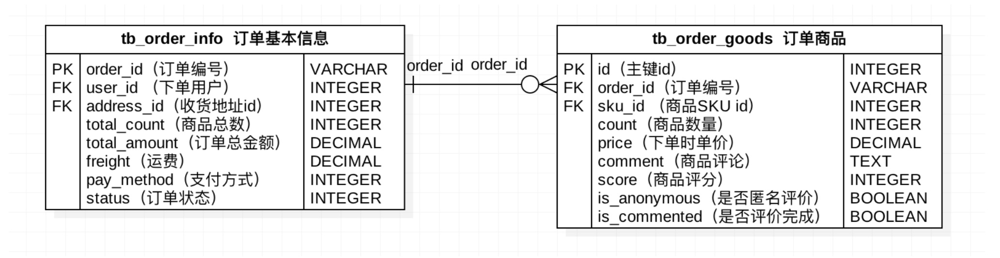

#### 4,订单模型类迁移

- 目的: 能够通过模型类迁移生成订单表

- 操作流程:

  - 1,模型类定义

    ```python
    from django.db import models
    
    from goods.models import SKU
    from meiduo_mall.utils.models import BaseModel
    from users.models import User, Address
    
    
    class OrderInfo(BaseModel):
        """订单信息"""
        PAY_METHODS_ENUM = {
            "CASH": 1,
            "ALIPAY": 2
        }
        PAY_METHOD_CHOICES = (
            (1, "货到付款"),
            (2, "支付宝"),
        )
        ORDER_STATUS_ENUM = {
            "UNPAID": 1,
            "UNSEND": 2,
            "UNRECEIVED": 3,
            "UNCOMMENT": 4,
            "FINISHED": 5,
            "CANCEL":6
        }
        ORDER_STATUS_CHOICES = (
            (1, "待支付"),
            (2, "待发货"),
            (3, "待收货"),
            (4, "待评价"),
            (5, "已完成"),
            (6, "已取消"),
        )
        order_id = models.CharField(max_length=64, primary_key=True, verbose_name="订单号")
        user = models.ForeignKey(User, related_name="orders",on_delete=models.PROTECT, verbose_name="下单用户")
        address = models.ForeignKey(Address, on_delete=models.PROTECT, verbose_name="收货地址")
        total_count = models.IntegerField(default=1, verbose_name="商品总数")
        total_amount = models.DecimalField(max_digits=10, decimal_places=2, verbose_name="商品总金额")
        freight = models.DecimalField(max_digits=10, decimal_places=2, verbose_name="运费")
        pay_method = models.SmallIntegerField(choices=PAY_METHOD_CHOICES, default=1, verbose_name="支付方式")
        status = models.SmallIntegerField(choices=ORDER_STATUS_CHOICES, default=1, verbose_name="订单状态")
    
        class Meta:
            db_table = "tb_order_info"
            verbose_name = '订单基本信息'
            verbose_name_plural = verbose_name
    
        def __str__(self):
            return self.order_id
    
    
    class OrderGoods(BaseModel):
        """订单商品"""
        SCORE_CHOICES = (
            (0, '0分'),
            (1, '20分'),
            (2, '40分'),
            (3, '60分'),
            (4, '80分'),
            (5, '100分'),
        )
        order = models.ForeignKey(OrderInfo, related_name='skus', on_delete=models.CASCADE, verbose_name="订单")
        sku = models.ForeignKey(SKU, on_delete=models.PROTECT, verbose_name="订单商品")
        count = models.IntegerField(default=1, verbose_name="数量")
        price = models.DecimalField(max_digits=10, decimal_places=2, verbose_name="单价")
        comment = models.TextField(default="", verbose_name="评价信息")
        score = models.SmallIntegerField(choices=SCORE_CHOICES, default=5, verbose_name='满意度评分')
        is_anonymous = models.BooleanField(default=False, verbose_name='是否匿名评价')
        is_commented = models.BooleanField(default=False, verbose_name='是否评价了')
    
        class Meta:
            db_table = "tb_order_goods"
            verbose_name = '订单商品'
            verbose_name_plural = verbose_name
    
        def __str__(self):
            return self.sku.name
    
    ```

  - 2,注册到INSTALLED_APPS中

    ```python
    INSTALLED_APPS = [
        ...
        'orders.apps.OrdersConfig'
    ]
    ```

  - 3,迁移

#### 5,保存订单类视图

- 目的: 能够定义类视图,校验提交过来的数据

- 操作流程:

  - 1,子路由(orders/urls.py)

    ```python
    url(r'^orders/commit/$',views.OrderCommitView.as_view()),
    ```

  - 2,类视图(orders/views.py)

    ```python
    class OrderCommitView(View):
        def post(self,request):
            #1,获取参数
            dict_data = json.loads(request.body.decode())
            address_id = dict_data.get("address_id")
            pay_method = dict_data.get("pay_method")
    
            #2,校验参数
            #2.1为空校验
            if not all([address_id,pay_method]):
                return http.HttpResponseForbidden("参数不全")
    
            #2.2地址校验
            try:
                address = Address.objects.get(id=address_id)
            except Exception as e:
                return http.HttpResponseForbidden('地址不存在')
    
            #2.3支付方式校验
            if pay_method not in [OrderInfo.PAY_METHODS_ENUM["CASH"],OrderInfo.PAY_METHODS_ENUM["ALIPAY"]]:
                return http.HttpResponseForbidden("支付方式有误")
    
            #3,数据入库
    
            #4,返回响应
    
            pass
    ```

  - 3,前端页面调整

    - 默认地址

      - 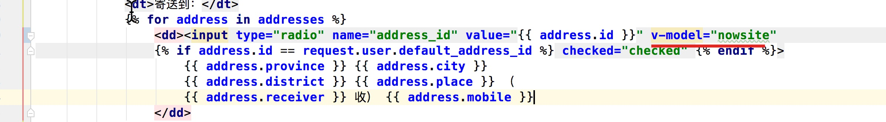

    - 添加两个变量

      ​	- 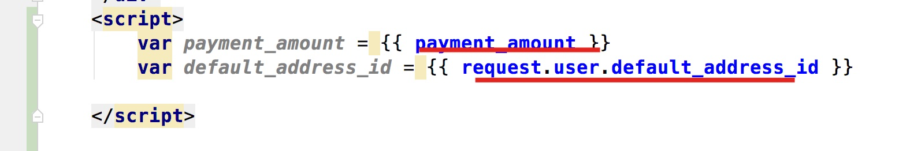

    - 默认支付方式

      - 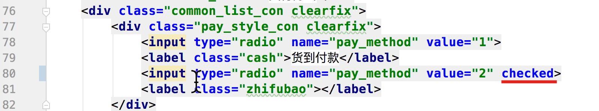

#### 6,保存订单基本信息

- 目的: 能够创建订单信息表,并设置属性

- 操作流程:

  - 类视图(orders/views.py)

    ```python
    class OrderCommitView(MyLoginRequiredMiXinView):
        def post(self,request):
            #1,获取参数
            dict_data = json.loads(request.body.decode())
            address_id = dict_data.get("address_id")
            pay_method = dict_data.get("pay_method")
            user = request.user
    
            ...
               
    
            #2.4构建订单编号(只要能尽量保证所有的用户都不重复即可)
            order_id = timezone.now().strftime('%Y%m%d%H%M%S') + "%06d"%user.id
    
            #2.5创建支付状态
            if pay_method == OrderInfo.PAY_METHODS_ENUM["CASH"]:
                status = OrderInfo.ORDER_STATUS_ENUM["UNSEND"]
            else:
                status = OrderInfo.ORDER_STATUS_ENUM["UNPAID"]
    
            #3,数据入库
            order = OrderInfo.objects.create(
                order_id=order_id,
                user=user,
                address=address,
                total_count=0,
                total_amount=Decimal(0.0),
                freight=Decimal(10.0),
                pay_method=pay_method,
                status=status,
            )
    
            #4,返回响应
    
            pass
    ```

    

#### 7,保存订单商品信息

- 目的: 能够去获取商品信息, 创建订单商品表

- 操作流程:

  - 1, 类视图(orders/views.py)

    ```python
    class OrderCommitView(MyLoginRequiredMiXinView):
        def post(self,request):
            ....
    
            #4,订单商品信息入库
            redis_conn = get_redis_connection("cart")
            cart_dict = redis_conn.hgetall("cart_%s"%user.id)
            cart_selected_list = redis_conn.smembers("cart_selected_%s"%user.id)
    
            for sku_id in cart_selected_list:
                #4.1获取商品对象,数量
                sku = SKU.objects.get(id=sku_id)
                count = int(cart_dict[sku_id])
    
                #4.2判断库存是否足够
                if count > sku.stock:
                    return http.HttpResponseForbidden("库存不足")
    
                #4.3减少库存,增加销量
                sku.stock -= count
                sku.sales += count
                sku.save()
    
                #4.4设置order信息,累加
                order.total_count += count
                order.total_amount += (count * sku.price)
    
                #4.5创建订单商品信息对象
                OrderGoods.objects.create(
                    order=order,
                    sku=sku,
                    count=count,
                    price=sku.price,
                )
    
            #5.提交订单
            order.save()
    
            #6.清空redis中选中的商品
            redis_conn.hdel("cart_%s"%user.id,*cart_selected_list)
            redis_conn.srem("cart_selected_%s"%user.id,*cart_selected_list)
    
            #7,返回响应
            context = {
                "code":RET.OK,
                "order_id":order_id,
                "payment_amount":order.total_amount + order.freight,
                "pay_method":pay_method
            }
            return http.JsonResponse(context)
    ```

#### 8,订单问题演示

- 目的: 知道不做事务处理, 所产生的影响
- 问题:
  - 1,同一订单,部分商品不够,但是能够创建订单
  - 2,产生脏数据
- 解决:
  - 1,同生共死, 使用事务

#### 9,订单创建开启事务

- 目的: 能够参考文档,在代码使用事务解决商品提交的问题
- 操作流程:
  - 1, 开启事物
    - @transaction.atomic
  - 2,设置保存点
    - sid = transaction.savepoint()
  - 3,回滚
    - transaction.savepoint_rollback(sid)
  - 4,提交
    - transaction.savepoint_commit(sid)

#### 10,并发下单分析

- 图解:
  - 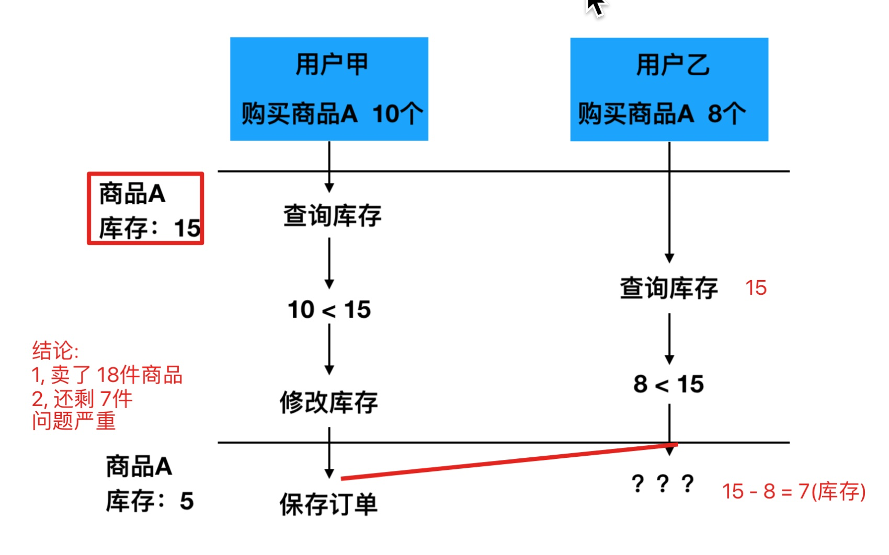

#### 11,订单创建并发下单测试

- 目的: 能够理解并发下单产生的问题

#### 12,悲观锁&乐观锁

- 目的: 能够理解悲观锁, 乐观锁的含义
  - 悲观锁: 容易造成死锁现象
    - 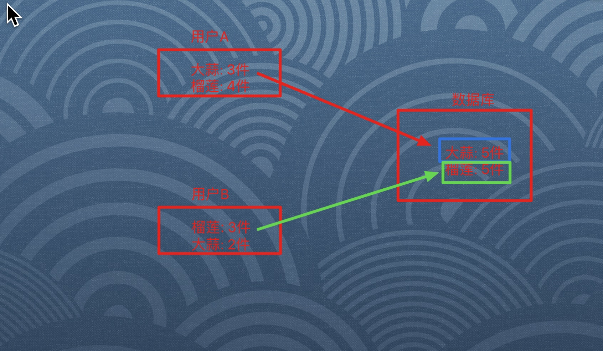
  - 乐观锁: 修改之前和之前查询的库存做判断
    - 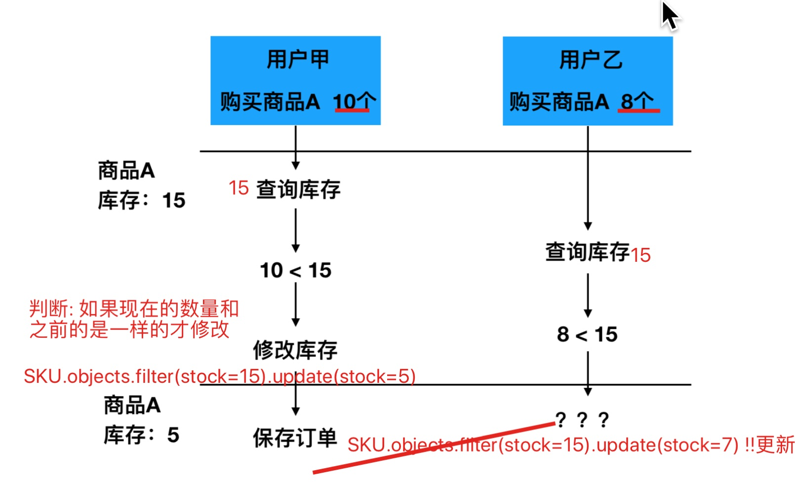

#### 13,乐观锁解决并发下单

- 目的: 能够知道如何使用代码, 乐观锁,解决并发下问题

- 操作流程:

  - 1,类视图

    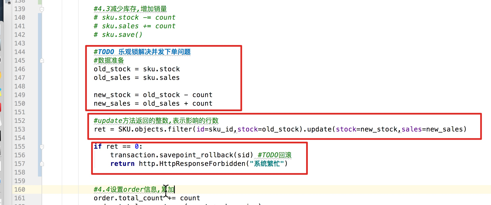

    

#### 14,并发下单,乐观锁优化

- 目的: 能够理解乐观锁的bug,并且能够用户提交订单

  - 操作流程:

    ```python
            for sku_id in cart_selected_list:
                while True: #新增
                  
              			....
    
                    if ret == 0:
                        # transaction.savepoint_rollback(sid) #TODO回滚
                        # return http.HttpResponseForbidden("系统繁忙")
                        continue #新增
    								...
    
                    
                    break #一定要break #新增
    ```

    

#### 15,mysql事务隔离级别(理解)

- 目的: 能够了解mysql中的常见的四种事务
  - 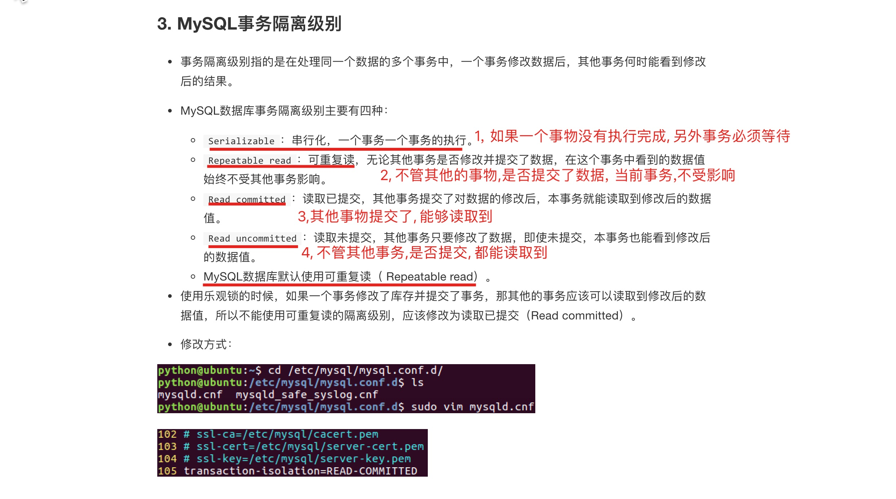