#### 1,下单成功

- 目的: 能够展示订单的数据到,下单成功的页面中

- 操作流程:

  - 1, 子路由(orders/urls.py)

  - ```python
    url(r'^orders/success/$',views.OrderSuccessView.as_view()),
    ```

  - 2,类视图(orders/views.py)

  - ```python
    class OrderSuccessView(View):
        def get(self,request):
    
            #1,获取参数
            order_id = request.GET.get("order_id")
            payment_amount = request.GET.get("payment_amount")
            pay_method = request.GET.get("pay_method")
    
            #2,拼接数据,渲染页面
            context = {
                "order_id":order_id,
                "payment_amount":payment_amount,
                "pay_method":pay_method,
            }
            return render(request,'order_success.html',context=context)
    ```

  - 3,渲染模板(order_sucesses.html)

    - 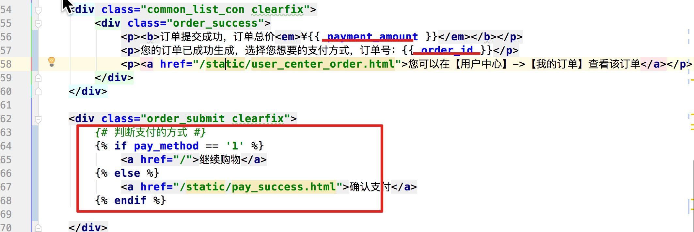

#### 2, 支付宝应用创建

- 目的: 能够使用沙箱中的内容或者, 实名之后的具体应用

- 操作流程:

  - 网站: https://open.alipay.com/platform/home.htm

  ```python
  记录信息:
  1, APPID(标记具体的商家) 2016092700606753
  2, 支付宝网关(用户支付的时候需要跳转的链接)  https://openapi.alipaydev.com/gateway.do
  3, 记录账号:
  	买家账号: gsstvx5373@sandbox.com
  	登录密码: 111111
  	支付密码: 111111
  ```

#### 3,支付流程

- 目的: 需要知道支付的流程的6个步骤
- 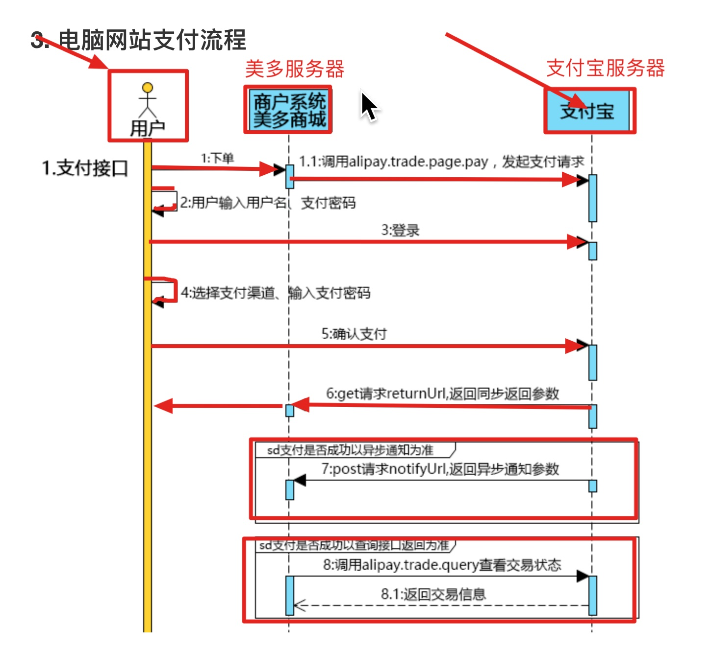

#### 4,配置RSA2秘钥对

- 目的: 能够去生成美多的私钥公钥, 可以交换公钥对, 知道公钥私钥的作用

  - 私钥公钥

  - ```python
    openssl
    OpenSSL> genrsa -out app_private_key.pem   2048  # 私钥
    OpenSSL> rsa -in app_private_key.pem -pubout -out app_public_key.pem # 导出公钥
    OpenSSL> exit
    ```

  - 可以交换公钥对

    - 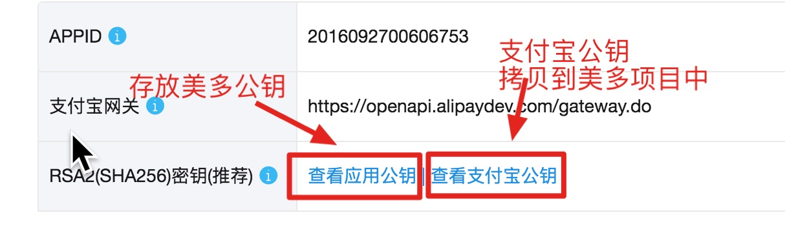

  - 公钥私钥作用:

    - 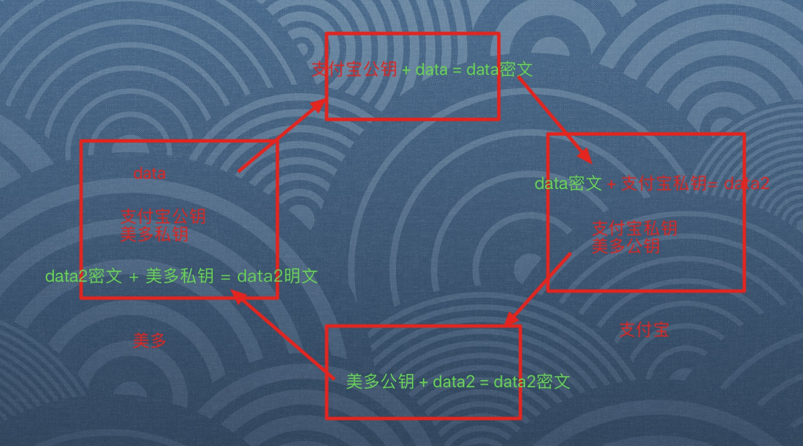

#### 5,获取支付页面类视图

- 目的: 能够编写类视图,然后处理支付页面

- 操作流程:

  - 1, 设置模板点击(order_success.html)

    - 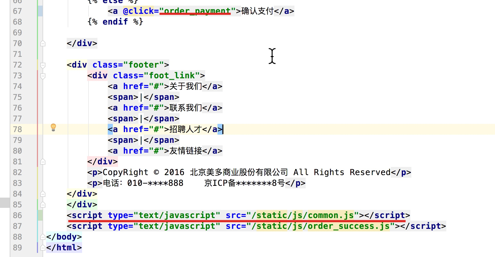

  - 2,根路由(meiduo_mall/urls.py)

  - ```python
    url(r'^', include('payment.urls')),
    ```

  - 3,子路由(payment/urls.py)

  - ```python
    url(r'^payment/(?P<order_id>\d+)/$',views.AlipayView.as_view())
    ```

  - 4,类视图(payment/view.py)

  - ```python
    class AlipayView(View):
        def get(self,request,order_id):
            return http.JsonResponse({"code":RET.OK,"alipay_url":'http://www.baidu.com'})
    
    ```

#### 6,支付页面实现

- 目的: 能够在前端页面中显示支付宝页面,去支付

- 操作流程:

  - 1, 类视图(payment/views.py)

  - ```python
    class AlipayView(View):
        def get(self,request,order_id):
    
            #0,取出订单对象
            try:
                order = OrderInfo.objects.get(order_id=order_id)
            except Exception as e:
                return http.HttpResponseForbidden('非法请求')
    
            #1,准备公钥私钥
            app_private_key_string = open(settings.APLIPAY_PRIVATE_KEY).read()
            alipay_public_key_string = open(settings.APLIPAY_PUBLIC_KEY).read()
    
            #2,创建alipay对象
            alipay = AliPay(
                appid=settings.ALIPAY_APPID,
                app_notify_url=None,  # 默认回调url
                app_private_key_string=app_private_key_string,
                # 支付宝的公钥，验证支付宝回传消息使用，不是你自己的公钥,
                alipay_public_key_string=alipay_public_key_string,
                sign_type="RSA2", # RSA 或者 RSA2
                debug = False  # 默认False
            )
    
            #3,生成订单字符串
            # 电脑网站支付，需要跳转到https://openapi.alipay.com/gateway.do? + order_string
            order_string = alipay.api_alipay_trade_page_pay(
                out_trade_no=order_id,
                total_amount=str(order.total_amount + order.freight),
                subject="美多商城订单",
                return_url=settings.ALIPAY_RETURN_URL,
            )
    
            #4,生成跳转url
            alipay_url = settings.ALIPAY_URL + order_string
    
    
            return http.JsonResponse({"code":RET.OK,"alipay_url":alipay_url})
    ```

  - 2,配置信息抽取(dev.py)

  - ```python
    #支付宝
    APLIPAY_PRIVATE_KEY = os.path.join(BASE_DIR,'apps/payment/keys/app_private_key.pem')
    APLIPAY_PUBLIC_KEY = os.path.join(BASE_DIR,'apps/payment/keys/app_public_key_ali.pem')
    ALIPAY_APPID = '2016092700606753'
    ALIPAY_DEBUG = True
    ALIPAY_URL = 'https://openapi.alipaydev.com/gateway.do?'
    ALIPAY_RETURN_URL = 'http://www.meiduo.site:8000/payment/status/'
    ```

#### 7,支付结果模型

- 目的: 能够定义模型类, 关联美多和支付宝的订单编号

- 操作流程:

  - 1, 定义模型类(payment/models.py)

  - ```python
    #1,关联美多和支付宝的订单编号
    class Payment(BaseModel):
        order = models.ForeignKey(OrderInfo,on_delete=models.CASCADE,verbose_name="美多订单号")
        trade_id = models.CharField(max_length=100,unique=True,null=True,blank=True,verbose_name="支付宝流水号")
    
        class Meta:
            db_table = "tb_payment"
    ```

  - 2,注册应用(dev.py/INSTALLED_APPS)

  - ```python
    'payment.apps.PaymentConfig'
    ```

#### 9,支付结果保存数据,支付结果保存类视图

- 目的: 能够保存支付结果

- 操作流程:

  - 1, 子路由(payment/urls.py)

    ```python
    url(r'^payment/status/$',views.PaymentStatusView.as_view()),
    ```

  - 2, 类视图(payment/views.py)

  - ```python
    class PaymentStatusView(View):
        def get(self,request):
            #1,获取参数
            dict_data = request.GET.dict()
            sign = dict_data.pop("sign")
    
            #2,校验参数
            app_private_key_string = open(settings.APLIPAY_PRIVATE_KEY).read()
            alipay_public_key_string = open(settings.APLIPAY_PUBLIC_KEY).read()
    
            #2,创建alipay对象
            alipay = AliPay(
                appid=settings.ALIPAY_APPID,
                app_notify_url=None,  # 默认回调url
                app_private_key_string=app_private_key_string,
                # 支付宝的公钥，验证支付宝回传消息使用，不是你自己的公钥,
                alipay_public_key_string=alipay_public_key_string,
                sign_type="RSA2", # RSA 或者 RSA2
                debug = False  # 默认False
            )
            success = alipay.verify(dict_data, sign)
    
            if not success:
                return http.HttpResponseForbidden("非法请求")
    
            #3,数据入库(payment, status)
            order_id = dict_data.get("out_trade_no")
            trade_id = dict_data.get("trade_no")
            Payment.objects.create(
                order_id=order_id,
                trade_id=trade_id
            )
            OrderInfo.objects.filter(order_id=order_id).update(status=OrderInfo.ORDER_STATUS_ENUM["UNCOMMENT"])
    
            #4,返回响应
            return render(request,'pay_success.html',context={"trade_id":trade_id})
    ```

  - 3, 页面渲染(pay_success.html)

  - 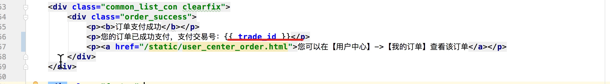

#### 10,用户订单页面展示

- 目的: 能够在用户中心显示商品订单页面

- 操作流程:

  - 1, 添加链接跳转(user_center_info.html)

    - 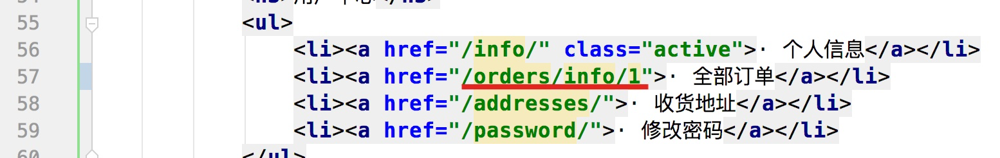

  - 2,子路由(orders/urls.py)

    - ```python
      url(r'^orders/info/(?P<page_num>\d+)/$',
          	views.UserOrderInfoView.as_view()),
      ```

      

  - 3,类视图(orders/views.py)

    ```python
    class UserOrderInfoView(View):
        def get(self,request,page_num):
            return render(request,'user_center_order.html')
    ```

#### 11,用户订单商品数据

- 目的: 能够显示用户的商品订单信息

  - 1, 类视图(orders/views.py)

    - ```python
      class UserOrderInfoView(MyLoginRequiredMiXinView):
          def get(self,request,page_num):
      
              #1,查询用户的所有订单
              orders =  request.user.orders.order_by("-create_time")
      
              #2,携带数据渲染
              context = {
                  "orders":orders
              }
              return render(request,'user_center_order.html',context=context)
      ```

  - 2,模板页面(user_center_order.html)

    - 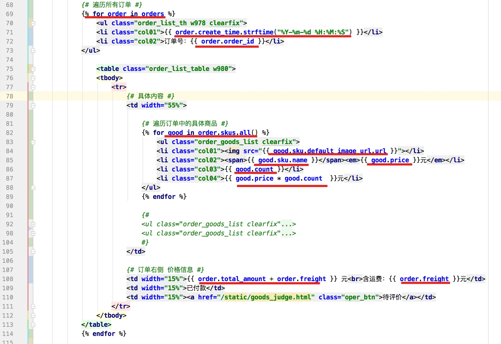

#### 12,用户订单商品分页

- 目的: 能够对用户的订单数据进行分页显示

  - 操作流程:

  - 1, 类视图(orders/views.py)

  - ```python
    class UserOrderInfoView(MyLoginRequiredMiXinView):
        def get(self,request,page_num):
    
            #1,查询用户的所有订单
            orders =  request.user.orders.order_by("-create_time")
    
            #2,分页
            paginate = Paginator(object_list=orders,per_page=3)
            page = paginate.page(page_num)
            orders_list = page.object_list#当前页对象列表
            current_page = page.number #当前页
            total_page = paginate.num_pages #总页数
    
            #2,携带数据渲染
            context = {
                "orders":orders_list,
                "current_page":current_page,
                "total_page":total_page
            }
            return render(request,'user_center_order.html',context=context)
    ```

  - 2,模板渲染(user_center_order.html)

    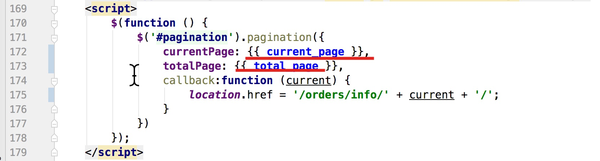

#### 13,展示商品状态信息

- 目的: 可以显示用户订单状态的汉字内容

- 操作流程:

  - 1, 类视图(orders/views.py)

  - ```python
    class UserOrderInfoView(MyLoginRequiredMiXinView):
        def get(self,request,page_num):
    				...
            #1,1处理支付方式,和状态
            for order in orders:
                order.paymethod_name = 				OrderInfo.PAY_METHOD_CHOICES[order.pay_method-1][1]
                order.status_name = OrderInfo.ORDER_STATUS_CHOICES[order.status-1][1]
    ```

  - 2,模板渲染(user_center_orders.html)

    - 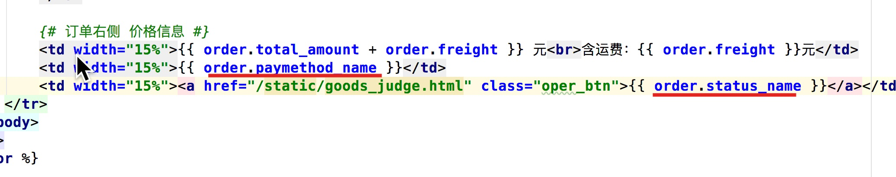

- 注意点:

  - 1, 支付方式的双向绑定(place_order.html)
  - 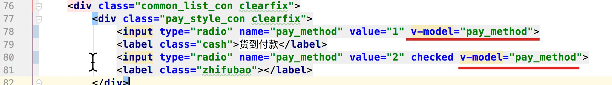
  - 2,支付方式需要转换整数(orders/views.py  OrderCommitView)
    - 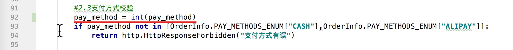

#### 14,logo制作

- 操作流程:

  - 1,子路由

  - ```python
    from django.conf.urls import url
    from . import views
    from django.views.generic import RedirectView
    
    urlpatterns = [
    	...   	 url(r'^favicon.ico$',RedirectView.as_view(url='static/mei_duo_logo.ico'))
    
    ]
    ```

  - 2,制作网站