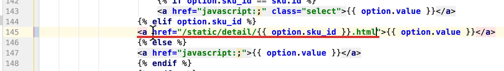
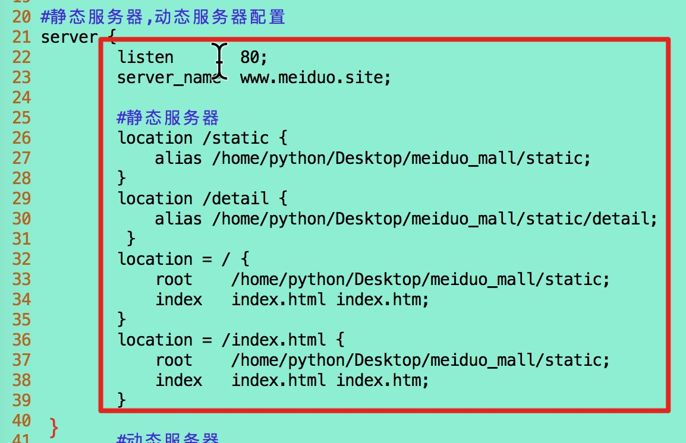
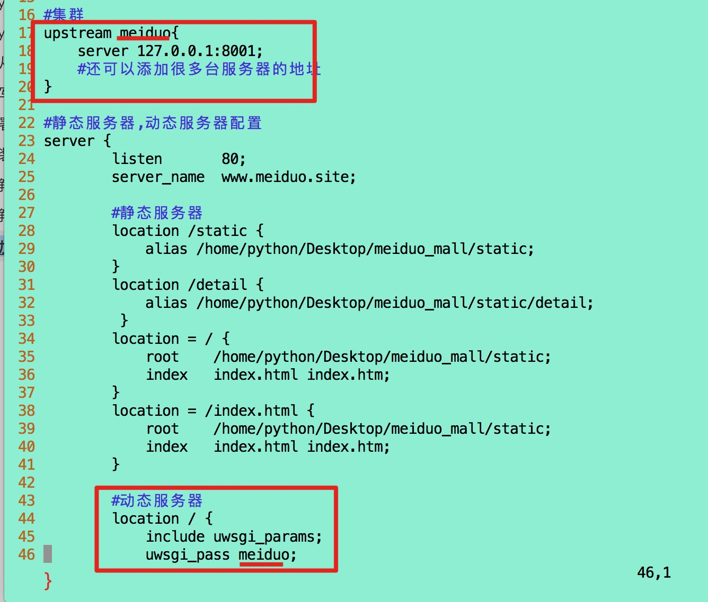
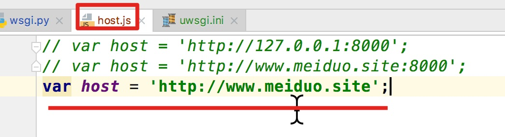

#### 0,静态化(理解)

- 目的: 能够理解静态化的含义和作用
- 含义: 将频繁访问而且不经常变动的内容,固定写死
- 作用: 提高服务器的响应速度

#### 1,广告页面静态化[理解]

- 目的: 能够将美多商城的首页进行静态化处理

- 操作流程:

  - 1, 静态化方法(contents/crons.py)

  - ```python
    from django.template import loader
    import os
    from meiduo_mall.utils.my_category import get_categories
    import time
    from .models import ContentCategory
    from django.conf import settings
    def generate_static_index_html():
        """
        生成静态的主页html文件
        """
        print('%s: generate_static_index_html' % time.ctime())
    
        #1,获取商品频道和分类
        categories = get_categories()
    
        #2,广告内容
        contents = {}
        content_categories = ContentCategory.objects.all()
        for cat in content_categories:
            contents[cat.key] = cat.content_set.filter(status=True).order_by('sequence')
    
        #3,渲染模板
        context = {
            'categories': categories,
            'contents': contents
        }
    
        #4,获取首页模板文件
        template = loader.get_template('index.html')
    
        #5,渲染首页html字符串
        html_text = template.render(context)
    
        #6,将首页html字符串写入到指定目录，命名'index.html'
        file_path = os.path.join(settings.STATICFILES_DIRS[0], 'index.html')
        with open(file_path, 'w', encoding='utf-8') as f:
            f.write(html_text)
    ```

  - 2,终端调用(先进入到和static统计的文件夹下面)

  - ```python
    python -m http.server 8080 --bind 127.0.0.1
    ```

  - 3,浏览器测试

    ```python
    http://www.meiduo.site:8080/static/index.html
    ```

    

#### 2,定时任务[掌握]

- 目的: 能够配置定时任务,定期生成首页页面静态化

- 操作流程:

  - 1, 安装

    - pip install django-crontab

  - 2,注册应用

  - ```python
    INSTALLED_APPS = [
        ...
        'django_crontab'
    ]
    ```

  - 3,配置

    ```python
    #定时任务
    CRONJOBS = [
        # 第一颗星: 分
        # 第二颗星: 时
        # 第三颗星: 日
        # 第四颗星: 月
        # 第五颗星: 周
        # 每1分钟生成一次首页静态文件, 参数2,需要执行的方法,  参数3,日志文件的存放位置
        ('*/1 * * * *', 'contents.crons.generate_static_index_html', '>> ' + os.path.join(os.path.dirname(BASE_DIR), 'logs/crontab.log'))
    ]
    CRONTAB_COMMAND_PREFIX = 'LANG_ALL=zh_cn.UTF-8'
    ```

  - 4,启动

    - python manage.py crontab add
    - python manage.py crontab remove
    - python manage.py crontab show

#### 3,详情页面静态化[理解]

- 目的: 能够将美多商城的详情页面进行静态化, 并且能够通过脚本的方式来调用

- 操作流程:

  - 1, 详情页静态化方法(scripts/generate_detail_html.py)

    - ```python
      #!/usr/bin/env python
      
      # #1,将scripts添加到导包路径
      import sys
      sys.path.insert(0, '../')
      
      #2,加载dev配置文件
      import os
      if not os.getenv('DJANGO_SETTINGS_MODULE'):
          os.environ['DJANGO_SETTINGS_MODULE'] = 'meiduo_mall.settings.dev'
      
      #3,让加载的环境变量dev生效
      import django
      django.setup()
      
      #4,导入用到的包
      from django.template import loader
      from meiduo_mall.utils.my_category import get_categories
      from meiduo_mall.utils.my_crumbs import get_crumbs
      from goods.models import SKU
      from django.conf import settings
      
      def generate_static_detail_html(sku_id):
          # 1,获取分类数据
          categories = get_categories()
      
          # 2,获取面包屑数据
          category = get_crumbs(sku_id)
      
          # 3,查询商品sku对象
          sku = SKU.objects.get(id=sku_id)
      
          # 4,商品sku规格信息
          # 构建当前商品的规格键
          sku_specs = sku.specs.order_by('spec_id')
          sku_key = []
          for spec in sku_specs:
              sku_key.append(spec.option.id)
          # 获取当前商品的所有SKU
          skus = sku.spu.sku_set.all()
          # 构建不同规格参数（选项）的sku字典
          spec_sku_map = {}
          for s in skus:
              # 获取sku的规格参数
              s_specs = s.specs.order_by('spec_id')
              # 用于形成规格参数-sku字典的键
              key = []
              for spec in s_specs:
                  key.append(spec.option.id)
              # 向规格参数-sku字典添加记录
              spec_sku_map[tuple(key)] = s.id
          # 获取当前商品的规格信息
          goods_specs = sku.spu.specs.order_by('id')
          # 若当前sku的规格信息不完整，则不再继续
          if len(sku_key) < len(goods_specs):
              return
          for index, spec in enumerate(goods_specs):
              # 复制当前sku的规格键
              key = sku_key[:]
              # 该规格的选项
              spec_options = spec.options.all()
              for option in spec_options:
                  # 在规格参数sku字典中查找符合当前规格的sku
                  key[index] = option.id
                  option.sku_id = spec_sku_map.get(tuple(key))
              spec.spec_options = spec_options
      
          # 携带数据渲染页面
          context = {
              "categories": categories,
              "category": category,
              "sku": sku,
              "specs": goods_specs
          }
      
          #1,获取详情页模板
          template = loader.get_template('detail.html')
          html_text = template.render(context)
      
          #2,获取文件路径
          file_path = os.path.join(settings.STATICFILES_DIRS[0], 'detail/'+str(sku_id)+'.html')
      
          #3,将数据写入到路径中
          with open(file_path, 'w',encoding='utf-8') as f:
              f.write(html_text)
      
      if __name__ == '__main__':
          skus = SKU.objects.all()
          for sku in skus:
              print(sku.id)
              generate_static_detail_html(sku.id)
      ```

  - 2, 在static中创建detail文件夹

  - 3,添加可执行权限generate_detail_html.py

    - chmod +x regenerate_detail_html.py

  - 4,终端调用即可

- 注意点:(templates/detail.html)

  - 

#### 4,mysql主从[理解]

- 目的: 能够知道主从通过的好处, 原理
- 好处:
  - 1, 提供读写性能(读写分离)
  - 2,提供数据的安全性(容灾机制)
- 原理:
  - 是通过二进制的文件进行数据的跟踪同步的

#### 5,mysql从服务器(参考文档)

- 目的: 能够通过镜像创建mysql从的容器
- 操作流程:(讲义)

#### 6,主从同步配置(参考文档)

- 目的:能够将主从mysql搭建在一起
- 操作流程:(参考讲义)
- 注意点:
  - sudo vi /etc/mysql/mysql.conf.d/mysqld.cnf  (主mysql的配置文件)

#### 7,读写分离配置[理解]

- 目的: 通过python代码操作数据库,实现读写分离

- 操作流程:

  - 1, 设置多个数据库(dev.py)

  - ```python
    DATABASES = {
        ...
        'default': { #主(写)
            'ENGINE': 'django.db.backends.mysql',
            'NAME': 'meiduo12',
            'USER': 'root',
            'PASSWORD': 'mysql',
            'HOST': '172.16.12.134',
            'PORT': '3306',
        },
        'slave': { #从(读)
            'ENGINE': 'django.db.backends.mysql',
            'NAME': 'meiduo12',
            'USER': 'root',
            'PASSWORD': 'mysql',
            'HOST': '172.16.12.134',
            'PORT': '8306',
        },
    }
    ```

  - 2,数据库管理类(utils/db_routers.py)

  - ```python
    class MasterSlaveDBRouter(object):
        """数据库读写路由"""
    
        def db_for_read(self, model, **hints):
            """读"""
            return "slave"
    
        def db_for_write(self, model, **hints):
            """写"""
            return "default"
    
        def allow_relation(self, obj1, obj2, **hints):
            """是否运行关联操作"""
            return True
    ```

  - 3,配置数据库管理类到dev.py中

  - ```python
    #获取读写的数据库
    DATABASE_ROUTERS = ['meiduo_mall.utils.db_routers.MasterSlaveDBRouter']
    ```

  - 4,浏览器读写分离测试

- 注意点

  - mac中的数据库,导出了一份ubuntu中

#### 8,部署分析[理解]

- 目的: 能够理解部署的流程
  - 


#### 9,安装Nginx[掌握]

- 目的: 能够安装nginx并知道配置文件,日志文件的位置

- 安装:

  - sudo apt-get install nginx

- 配置目录:

  - ```python
    /usr/sbin/nginx：主程序
    
    /etc/nginx：存放配置文件
    	需要修改的: /etc/nginx/sites-enabled/default
    
    /usr/share/nginx：存放静态文件
    
    /var/log/nginx：存放日志
    	需要查看的: var/log/nginx/access_log | error_log
    ```

#### 10,静态文件收集[掌握]

- 目的: 能够将静态文件收集到根目录中

- 操作流程:

  - 1, 指定收集的位置(dev.py)

    ```python
    #指定静态文件的收集位置
    STATIC_ROOT = os.path.join(os.path.dirname(BASE_DIR), 'static')
    ```

  - 2,终端中通过命令收集

    ```python
    python manage.py collectstatic
    ```

#### 11,静态文件部署[掌握]

- 目的: 能够配置静态文件的目录到nginx中
- 操作流程:
  - 1, 配置nginx
  - 

- nginx相关命令

  ```python
  1, sudo nginx -t 测试,建议只要改了配置应该测试
  2, sudo nginx -s reload, 重载
  3, sudo nginx stop
  4, sudo nginx start
  5, sudo nginx restart
  ```

  

#### 12,动态文件部署[掌握]

- 目的: 能够参考文档部署动态服务器

- 操作流程:

  - 1, 创建uwsgi.ini文件(和manage.py同级)

  - ```python
    [uwsgi]
    # 使用Nginx连接时使用，Django程序所在服务器地址
    socket=127.0.0.1:8001
    # 项目目录
    chdir=/home/python/Desktop/meiduo_mall
    # 项目中wsgi.py文件的目录，相对于项目目录
    wsgi-file=meiduo_mall/wsgi.py
    # 进程数
    processes=4
    # 线程数
    threads=2
    # uwsgi服务器的角色
    master=True
    # 存放进程编号的文件
    pidfile=uwsgi.pid
    # 日志文件
    daemonize=uwsgi.log
    # 指定依赖的虚拟环境
    virtualenv=/home/python/.virtualenvs/django_py3
    ```

  - 2,改变wsgi.py加载的配置环境为prod(meiduo_mall/wsgi.py)

  - ```python
    os.environ.setdefault("DJANGO_SETTINGS_MODULE", "meiduo_mall.settings.prod")
    ```

  - 3,配置nginx

    - 

  - 4,改变static中js/host.js中的访问地址

    - 


- 注意点:
  - 如果没有uwsgi需要安装pip install uwsgi