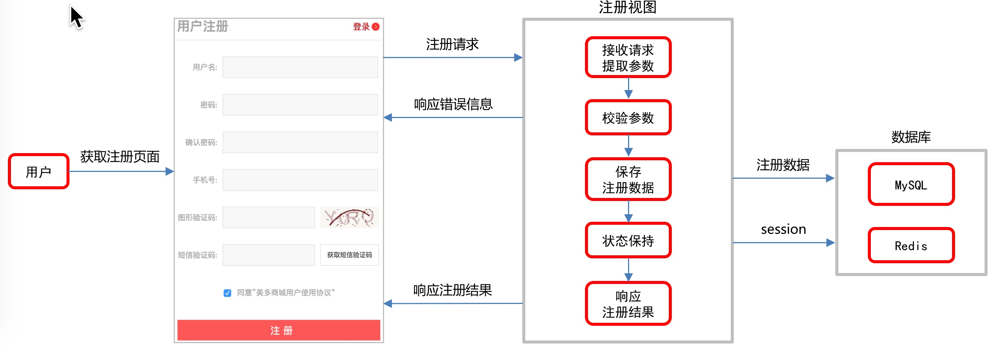
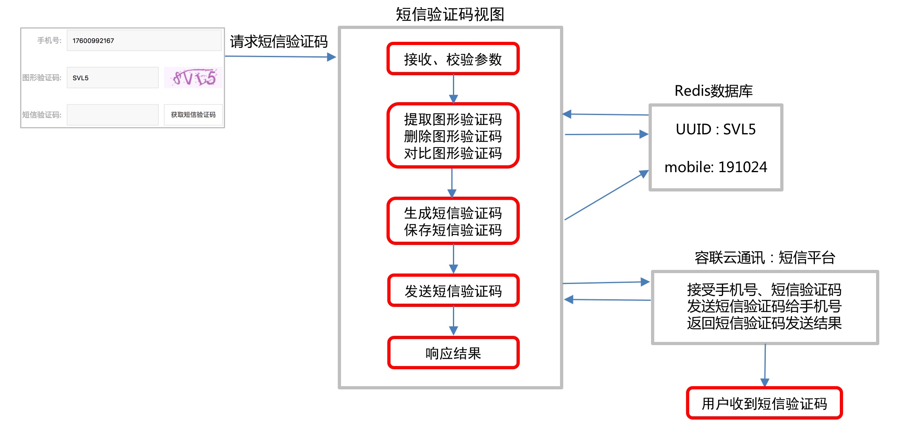

#### 1,注册业务分析

- 目的: 能够理解,注册流程

- 流程:

  

#### 2,注册接口设计

- 目的: 能够分析出接口设计的四要素
- 接口四要素
  - 1, 请求方式: POST
   - 2,请求路径:/register
   - 3,请求参数:username,password,re password,mobile, sms_code,allow
   - 4,返回响应: 状态(errormsg, code)

#### 3,注册前端业务逻辑分析

- 目的: 能够理解,点击注册的时候发生的事情
  - 过程:
  - 1, 当点击注册按钮的时候
  - 2, 首先通过on_submit方法校验数据的合法性
  - 3, 向当前的路径中提交一个post请求

#### 4,注册后端业务实现

- 目的: 能够实现注册的后端业务逻辑

- 操作流程:

- 1, 编写后端视图

  ```python
  class RegisterView(View):
      ...
      def post(self,request):
          #1,获取参数
          user_name = request.POST.get("user_name")
          pwd = request.POST.get("pwd")
          cpwd = request.POST.get("cpwd")
          phone = request.POST.get("phone")
          msg_code = request.POST.get("msg_code")
          allow = request.POST.get("allow")
  
          #2,校验参数
          #2,1 为空校验
          if not all([user_name,pwd,cpwd,phone,msg_code,allow]):
              return http.HttpResponseForbidden("参数不全")
  
          #2,2 两次密码校验
          if pwd != cpwd:
              return http.HttpResponseForbidden("两次密码不一致")
  
          #2,3 手机号格式校验
          if not re.match(r'1[3-9]\d{9}',phone):
              return http.HttpResponseForbidden("手机号格式有误")
  
          #2,4 短信验证码校验
  
          #2,5 协议校验
          if allow != 'on':
              return http.HttpResponseForbidden("必须同意协议")
  
          #3,创建用户对象,保存到数据库中
          user = User.objects.create_user(username=user_name,password=pwd,mobile=phone)
  
          #4,返回响应
          response = redirect("http://www.taobao.com")
          return response
  ```

  

- 2, 前端加上csrf_input

  ```python
  {{ csrf_input }}
  ```

  

#### 5,判断用户名重复注册

- 目的: 能够通过用户名,判断用户是否已经注册过了

- 操作流程:

- 1, 根据前端js代码编写url地址

  ```python
  from django.conf.urls import url
  from . import views
  
  urlpatterns = [
  		...
      url(r'^usernames/(?P<username>\w{5,20})/count/$',
          views.CheckUsernameView.as_view(),name="username"),
  ]
  ```

- 2, 编写类视图处理业务即可

  ```python
  class CheckUsernameView(View):
      def get(self,request,username):
          #1,根据用户名,查询用户数量
          count = User.objects.filter(username=username).count()
  
          #2,返回响应
          data = {
              "count":count
          }
          return http.JsonResponse(data)
  ```

  

#### 6,判断手机号重复注册

- 目的: 能够通过手机号,查询用户的数量

- 操作流程:

  - 1, 根据前端js代码,编写url地址

    ```python
    urlpatterns = [
        ...
        url(r'^mobiles/(?P<mobile>1[345789]\d{9})/count/$',
            views.CheckMobileView.as_view(),name="mobile"),
    ]
    ```

  - 2, 编写类视图处理即可

    ```python
    class CheckMobileView(View):
        def get(self,request,mobile):
            #1,根据手机号,查询用户数量
            count = User.objects.filter(mobile=mobile).count()
    
            #2,返回响应
            data = {
                "count":count
            }
            return http.JsonResponse(data)
    ```

    

#### 7,图片验证码生成

- 目的: 知道图片验证码的目的, 并且能够通过captcha生成图片验证码
  - 目的: 保证注册的用户是一个真实的用户
  - 添加captcha到libs中

#### 8,verifications应用创建

- 目的: 能够通过终端创建子应用

#### 9,图片验证码接口设计

- 目的:能够编写类视图, 返回一张图片验证码

- 操作流程:

  - 1,根据前端js代码,编写子应用url路由

    ```python
    from django.conf.urls import url
    from . import views
    
    urlpatterns = [
        url(r'^image_codes/(?P<image_code_id>.+)/$',views.ImageCodeView.as_view())
    ]
    ```

  - 2,将子应用的urls.py注册到根应用中

    ```python
    urlpatterns = [
        ...
        url(r'^', include('verifications.urls',namespace="verifications")),
    ]
    
    ```

  - 3,编写类视图

    ```python
    class ImageCodeView(View):
        def get(self,request,image_code_id):
    
            #1,生成图片验证码
            text,image_data =  captcha.generate_captcha()
    
            #2,保存图片验证码到redis中
    
            #3,返回响应
            return http.HttpResponse(image_data,content_type="image/png")
    ```

  - 4,在浏览器中进行调试即可

#### 10,图片验证码前端调试

- 目的: 调试前端的代码, 完善后端的业务逻辑

- 操作流程:

  - 前端,获取图片验证码的两种方式

    - 1,当页面一旦加载的时候,会自动发送一个请求到后端
    - 2,当点击图片的时候,也会发送一个请求到后端

  - 后端:

    - 1, 生成图片验证码,返回

    - 2, 并且存储到redis中一份

      ```python
      class ImageCodeView(View):
          def get(self,request,image_code_id):
      				...
              
              #2,保存图片验证码到redis中
              redis_conn = get_redis_connection("code")
              #分别对应的参数,key, time , value
              redis_conn.setex("image_code_%s"%image_code_id,300,text)
      
              ...
      
      ```

  - 注意点: 
    - 获取redis连接对象方法:  get_redis_connection('name')

#### 11,短信验证码分析

- 目的: 短信验证码的作用, 以及发送流程
- 作用: 可以收集用户信息,便于后期维护
- 流程:
  - 

- 注意点:
  - 发送短信必须使用三方平台,比如:==云通讯==,阿里云,腾讯云

#### 12,云通讯

- 目的: 能够集成云通讯到项目中, 并测试短信发送
- 操作流程:
  - 1, 注册
  - 2, 创建应用
  - 3, 添加测试账号
  - 4.导入yuntongxun到libs中

#### 13,短信验证码实现

- 目的: 能够使用云通讯发送短信

- 操作流程:

  - 1, 根据前端js代码编写url地址

    ```python
    from django.conf.urls import url
    from . import views
    
    urlpatterns = [
        ...
        url(r'^sms_codes/(?P<mobile>1[3-9]\d{9})/$',
            views.SmsCodeView.as_view()),
    ]
    ```

  - 2,编写类视图

    ```python
    class SmsCodeView(View):
        def get(self,request,mobile):
            #1,获取参数
            image_code = request.GET.get("image_code")
            image_code_id = request.GET.get("image_code_id")
    
            #2,校验参数
            #2,1 为空校验
            if not all([image_code,image_code_id]):
                return http.JsonResponse({"errmsg":"参数不全","code":RET.PARAMERR})
    
            #2,2 校验图片验证码的正确性
            redis_conn = get_redis_connection("code")
            redis_image_code =  redis_conn.get("image_code_%s"%image_code_id)
    
            #判断是否过期
            if not redis_image_code:
                return http.JsonResponse({"errmsg": "图片验证码过期了", "code": RET.NODATA})
    
            #删除
            redis_conn.delete("image_code_%s"%image_code_id)
    
            #正确性
            if image_code.lower() != redis_image_code.decode().lower():
                return http.JsonResponse({"errmsg": "图片验证码错误", "code":RET.DATAERR})
    
            #3,发送短信
            sms_code = "%06d"%random.randint(0,999999)
            ccp = CCP()
            ccp.send_template_sms(mobile, [sms_code, constants.REDIS_SMS_CODE_EXPIRES/60], 1)
    
            #保存到redis中
            redis_conn.setex("sms_code_%s"%mobile,constants.REDIS_SMS_CODE_EXPIRES,sms_code)
    
            #4,返回响应
            return http.JsonResponse({"errmsg":"发送成功","code":RET.OK})
    ```

  - 3,定义常量文件

    - 状态码文件: /utils/response_code.py
    - 常量文件: verifications/constants.py

  - 4,前端调试