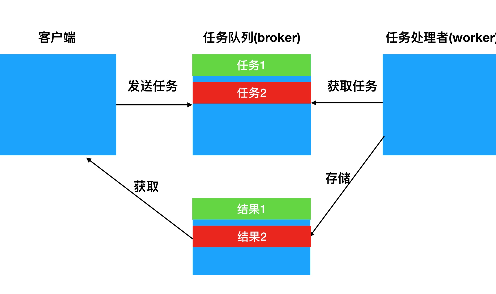
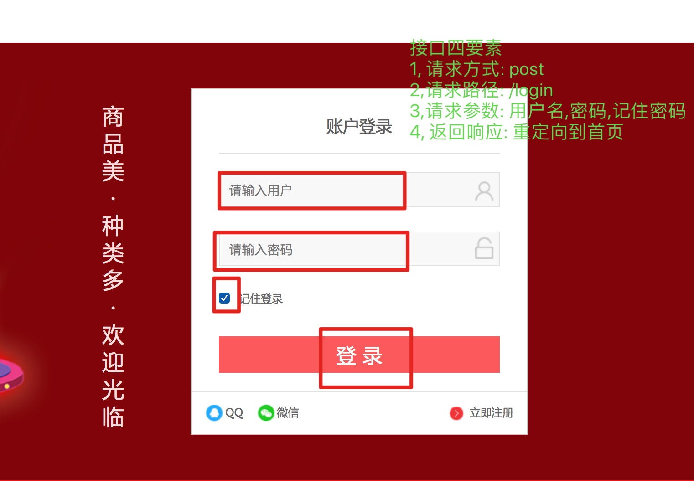

#### 1,短信验证码频繁

- 目的: 能够定义标记,防止短信验证码频繁发送

  ```python
  class SmsCodeView(View):
      def get(self,request,mobile):
          ...
          #判断是否频繁发送
          send_flag = redis_conn.get("send_flag_%s"%mobile)
          if send_flag:
              return http.JsonResponse(
                {"errmsg":"频繁发送","code":RET.SMSCODERR})
  
          ...
  
          redis_conn.setex("send_flag_%s"%mobile,
                           constants.REDIS_SEND_FLAG_EXPIRES,True)
  
          #4,返回响应
          return http.JsonResponse({"errmsg":"发送成功","code":RET.OK})
  ```

#### 2,pipeline操作redis

- 目的: 知道pipeline的作用,并且能够在代码中进行使用

- 作用: 将多个命令组合在一起, 同生共死

- 操作流程:

  - 1, 终端调试

    ```python
    In [1]: from django_redis import get_redis_connection                                                                                                              
    
    In [2]: #1, 获取redis对象                                                                                                                                          
    
    In [3]: redis_conn = get_redis_connection("default")                                                                                                               
    
    In [4]: redis_conn                                                                                                                                                 
    Out[4]: StrictRedis<ConnectionPool<Connection<host=127.0.0.1,port=6379,db=0>>>
    
    In [5]: redis_conn.set("a",10)                                                                                                                                     
    Out[5]: True
    
    In [6]: #2,获取管道对象                                                                                                                                            
    
    In [7]: pipeline =  redis_conn.pipeline()                                                                                                                          
    
    In [8]: pipeline.set("name","laowang")                                                                                                                             
    Out[8]: StrictPipeline<ConnectionPool<Connection<host=127.0.0.1,port=6379,db=0>>>
    
    In [10]: pipeline.set("age",13)                                                                                                                                    
    Out[10]: StrictPipeline<ConnectionPool<Connection<host=127.0.0.1,port=6379,db=0>>>
    
      # 3, 提交管道对象
    In [11]: pipeline.execute()                                                                                                                                        
    Out[11]: [True, True]
    
    ```

  - 2,代码添加

    ```python
            #保存到redis中
            pipeline = redis_conn.pipeline()
            pipeline.setex("sms_code_%s"%mobile,
                           constants.REDIS_SMS_CODE_EXPIRES,sms_code)
            pipeline.setex("send_flag_%s"%mobile,
                           constants.REDIS_SEND_FLAG_EXPIRES,True)
            pipeline.execute()
    
    ```

    

#### 3,celery介绍

- 目的: 知道celery的作用, 执行流程

- 作用: 处理耗时任务, 比如: 短信发送,图片上传, 邮件发送等等

- 处理流程:

  

#### 4,celery测试

- 目的: 能够参考官方文档,测试celery的使用效果

- 操作流程:

  - 1, 创建celery_task包和logs同级

    ```python
    from __future__ import absolute_import, unicode_literals
    import os
    from celery import Celery
    
    #1,设置环境变量
    os.environ.setdefault("DJANGO_SETTINGS_MODULE", "meiduo_mall.settings.dev")
    
    #2,创建celery对象
    app = Celery('meiduo_mall')
    
    #3,加载配置文件
    app.config_from_object('celery_tasks.config', namespace='CELERY')
    
    #4,注册任务
    app.autodiscover_tasks()
    
    #启动celery任务
    # celery -A celery_tasks.main worker -l info
    
    #装饰任务
    @app.task(bind=True,name="xixi")
    def debug_task(self,count):
        import time
        for i in range(0,count):
            time.sleep(1)
            print("i = %s"%i)
    ```

  - 2, 编写config.py配置文件

    ```python
    broker_url = 'redis://127.0.0.1:6379/14' #存放任务的
    result_backend = 'redis://127.0.0.1:6379/15' #储存结果的
    
    ```

  - 3,在终端开启celery任务, 然后发送任务测试即可

    - 开启任务: celery -A celery_tasks.main worker -l info
    - 发送任务: debug_task.delay(count)

#### 5, 使用包的形式封装test任务

- 目的:能够定义好test包,并添加到app中

- 格式:

  - 1,创建和main.py同级的test包

  - 2,创建tasks.py任务模块

    ```python
    from celery_tasks.main import app
    
    
    @app.task(bind=True,name="xixi")
    def debug_task(self,count):
        import time
        for i in range(0,count):
            time.sleep(1)
            print("i = %s"%i)
    ```

  - 3,注册任务到app中

    ```python
    app.autodiscover_tasks(["celery_tasks.test.tasks"])
    ```

    

#### 6,celery短信发送

- 目的: 能够封装模块,发送短信

- 操作流程:

  - 1, 定义sms模块,编写tasks任务

    ```python
    from celery_tasks.main import app
    from meiduo_mall.libs.yuntongxun.sms import CCP
    
    #bind: 会将第一个参数绑定到函数的第一参数
    #name: 表示任务的名称
    @app.task(bind=True,name="sms_code")
    def send_sms_code(self,mobile,sms_code,time):
        # import time
        # time.sleep(10)
    
        ccp = CCP()
        ccp.send_template_sms(mobile, [sms_code, time], 1)
    
    ```

  - 2,注册任务到app中

    ```python
    app.autodiscover_tasks([...,"celery_tasks.sms.tasks"])
    ```

    

  - 3,在代码中使用celery发送

    ```python
    class SmsCodeView(View):
        def get(self,request,mobile):
            ...
            #使用celery发送短信
            from celery_tasks.sms.tasks import send_sms_code
            send_sms_code.delay(mobile,
                                sms_code,constants.REDIS_SMS_CODE_EXPIRES/60)
    ```


#### 7,发送短信重试

- 目的: 能够设置celery中的参数,调试重试的过程

  ```python
  @app.task(bind=True,name="sms_code")
  def send_sms_code(self,mobile,sms_code,time):
      # import time
      # time.sleep(10)
      #1,发送短信
      try:
          ccp = CCP()
          result =  ccp.send_template_sms(mobile, [sms_code, time], 1)
      except Exception as e:
          result = -1
  
      #2,判断结果
      if result == -1:
          print("重试中....")
          self.retry(countdown=5,max_retries=3,exc=Exception("发送短信失败啦!!!"))
  
  ```

- 注意点

- retry(countdown=5,max_retries=3,exc=Exception("发送短信失败啦!!!"))

  - countdown: 间隔的时间
  - max_retries: 重试的次数
  - exc: 失败之后报出的异常信息

#### 8,RabbitMQ介绍(了解)

- 目的: 知道rabbitMQ的作用, 和特点
  - 作用: 可以存储消息队列, 和redis类似的, 还可以做秒杀业务
  - 特点: 稳定性更好, 高并发

#### 9,RabbitMQ基本使用(了解)

- 目的: 能够参考文档, 安装Erlang, Rabbitmq-server, 还能通过提供的代码测试生产者,消费者行为
- 注意点
  - 安装pika的版本是: pip install pika==0.13.1

#### 10,用户登陆分析

- 目的: 如何处理登陆的业务流程, 能够返回登陆页面, 接口信息
- 返回登陆页面:
  - 1, 根据前端页面,编写子路由

    ```python
    urlpatterns = [
        ...
        url(r'^login/$',views.LoginUserView.as_view())
    ]
    ```

    

  - 2, 编写类视图渲染页面

    ```python
    class LoginUserView(View):
        def get(self,request):
            return render(request,'login.html')
    ```

- 接口信息
- 

#### 11,登陆实现

- 目的: 处理登陆业务实现的代码,并校验相关的参数

- 操作流程:

  ```python
  class LoginUserView(View):
      def get(self,request):
          return render(request,'login.html')
  
      def post(self,request):
          #1,获取参数
          username = request.POST.get("username")
          password = request.POST.get("pwd")
          remembered = request.POST.get("remembered")
  
          #2,校验参数
          #2,0 为空校验
          if not all([username,password]):
              return http.HttpResponseForbidden("参数不全")
  
          #2,1 用户名格式校验
          if not re.match(r'^[a-zA-Z0-9_-]{5,20}$',username):
              return http.HttpResponseForbidden("用户名格式有误")
  
          #2,2 密码格式校验
          if not re.match(r'^[0-9A-Za-z]{8,20}$',password):
              return http.HttpResponseForbidden("密码格式有误")
  
          #2,3 校验用户名和密码的正确性
          user = authenticate(request, username=username, password=password)
  
          if not user:
              return http.HttpResponseForbidden("账号或者密码错误")
  
          #3,状态保持
  
          #4,返回响应
          pass
  ```

  

#### 12, 登陆状态保持实现

- 目的: 如何通过django代码实现,状态保持

- 操作流程:

  ```python
  class LoginUserView(View):
      ...
  
      def post(self,request):
          ...
          #3,状态保持
          login(request, user)
  
          #3,1设置状态保持的时间
          if remembered == "on":
              request.session.set_expiry(3600*24*2) #两天有效
          else:
              request.session.set_expiry(0)
  
          #4,返回响应
          return http.HttpResponse("登陆成功")
  ```

- 注意点:

  - authenticate: 校验用户名密码正确性
  - login(): 实现状态保持的, 默认是两个星期

#### 13,多账号登陆

- 目的: 能够通过django中的代码, 实现多账号登陆

- 操作流程:

  - 1, 自定义类,继承自ModelBackend方法

    ```python
    from django.contrib.auth.backends import ModelBackend
    import re
    from users.models import User
    class MyAuthenticateBackend(ModelBackend):
    
        def authenticate(self, request, username=None, 
                         password=None, **kwargs):
            try:
                #1,先判断username是否是手机号
                if re.match(r'^1[3-9]\d{9}$',username):
                    user =  User.objects.get(mobile=username)
                else:
                    #2,然后在通过用户名查询,用户
                    user = User.objects.get(username=username)
            except User.DoesNotExist:
                return None
            else:
                return user
    ```

  - 2,指定认证后端

    ```python
    AUTHENTICATION_BACKENDS = ['meiduo_mall.utils.authenticate.MyAuthenticateBackend']
    
    ```

    

#### 14,首页展示

- 目的: 能够创建子应用,渲染首页
- 首页显示:
  - 1,创建contents子应用
  - 2, 定义类视图
	 ```python
	class IndexView(View):
  	    def get(self,request):
  	        return render(request,'index.html')
	
	````
  - 3,编写子路由
     ```python
from django.conf.urls import url
    from . import views
    
    urlpatterns = [
      url(r'^$',views.IndexView.as_view())
	  ]
	  ````
	- 4,注册根路由
		 ```python
	urlpatterns = [
		    ...
		    url(r'^', include('contents.urls',namespace="contents")),
		]
		
		````

#### 15,用户名设置

- 目的: ,能够在首页的右上角显示用户名

- 操作流程:

  ```python
  class LoginUserView(View):
      ...
      def post(self,request):
          ...
          #4,返回响应
          response = redirect('/')
          response.set_cookie("username",user.username,3600*24*2)
          return response
  ```

  

#### 16,退出登陆

- 目的: 能够通过代码,清除cookie和session信息

- 操作流程:

  - 1,编写类视图users/views.py

    ```python
    class LogoutUserView(View):
        def get(self,request):
            #1,清除session
            logout(request)
    
            #2,清除cookie
            response = redirect('/')
            response.delete_cookie("username")
            return response
    ```

  - 2,编写子路由,users/urls.py

    ```python
    url(r'^logout/$',views.LogoutUserView.as_view())
    ```

    