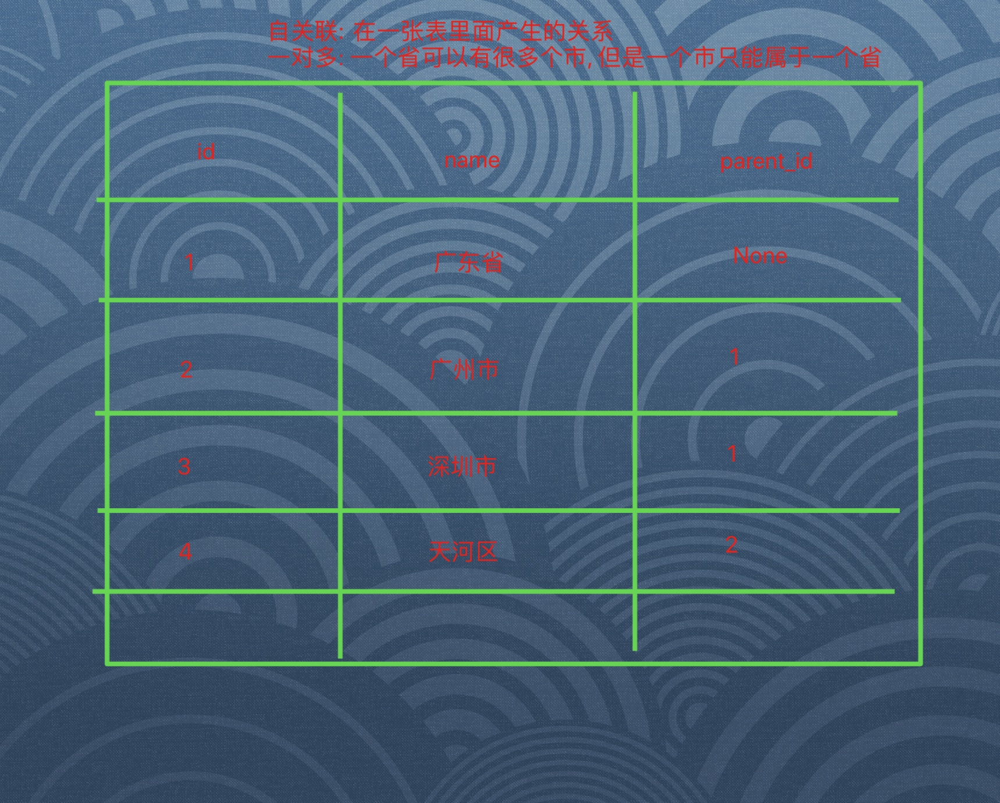

#### 1,获取用户中心数据

- 目的: 在渲染用户中心界面的时候,能够携带用户的数据

- 操作流程:

  - 1, 给用户模型添加email_active字段

    ```python
    
    class User(AbstractUser):
        ...
        email_active = models.BooleanField(default=False,verbose_name="邮箱激活状态")
    ```

  - 2, 迁移

  - 3,在类视图中渲染即可

    ```python
    class UserCenterView(MyLoginRequiredMiXinView):
    
        def get(self,request):
            #1,组织数据
            context = {
                "username":request.user.username,
                "mobile":request.user.mobile,
                "email":request.user.email,
                "email_active":request.user.email_active
            }
    
            #2,返回页面渲染
            return render(request, 'user_center_info.html',context=context)
    ```

    

#### 2,邮箱发送文档,测试

- 目的: 能够参考官方文档发送邮件,测试即可

- 操作流程:

  - 1, 配置邮件后端(dev.py)

    ```python
    #邮件配置
    EMAIL_BACKEND = 'django.core.mail.backends.smtp.EmailBackend' # 指定邮件后端
    EMAIL_HOST = 'smtp.163.com' # 发邮件主机
    EMAIL_PORT = 25 # 发邮件端口
    EMAIL_HOST_USER = 'jinghedeveloper@163.com' # 授权的邮箱
    EMAIL_HOST_PASSWORD = 'abcd1234' # 邮箱授权时获得的密码，非注册登录密码
    EMAIL_FROM = '美多商城<jinghedeveloper@163.com>' # 发件人抬头
    ```

  - 2,在终端中测试

    ```python
    In [1]: from django.core.mail import send_mail                                                                                                                     
                                                                                                                                                                
    
    In [2]: send_mail(subject='约吗?',message='今晚小树林',from_email='jinghedeveloper@163.com',recipient_list=['hejing@itcast.cn'])   
    ```

    

#### 3,邮件发送后端集成

- 目的: 能够通过代码的格式实现邮件发送

- 操作流程:

  - 1, 根据前端页面编写子路由

    ```python
    urlpatterns = [
        ...
        url(r'^emails/$',views.EmailSendView.as_view()),
    ]
    ```

  - 2,编写发送邮件类视图

    ```python
    class EmailSendView(MyLoginRequiredMiXinView):
        def put(self,request):
            #1,获取参数
            dict_data = json.loads(request.body.decode())
            email = dict_data.get("email")
    
            #2,校验参数
            #2.1 为空校验
            if not email:
                return http.HttpResponseForbidden("参数不全")
    
            #2.2 格式校验
            if not re.match(r'^[a-z0-9][\w\.\-]*@[a-z0-9\-]+(\.[a-z]{2,5}){1,2}$',email):
                return http.HttpResponseForbidden("邮件格式有误")
    
            #3,发送邮件
            send_mail(subject='约吗?',
                      message='今晚小树林',
                      from_email=settings.EMAIL_FROM,
                      recipient_list=[email])
    
            #4,数据入库
            request.user.email = email
            request.user.save()
    
            #5,返回响应
            return http.JsonResponse({"code":RET.OK,"errmsg":"ok"})
    ```

#### 4,拼接验证链接

- 目的: 能够拼接加密的token链接, 发送给用户邮箱, 来激活用户邮箱

- 操作流程:

  - 1, 创建生成加密链接的方法(utils/email.py)

    ```python
    from django.conf import settings
    from itsdangerous import TimedJSONWebSignatureSerializer as TJSWSerializer
    
    #1,生成加密的url链接地址
    def generate_verify_url(user):
    
        #1,创建数据信息
        dict_data = {"user_id":user.id, "email":user.email}
    
        #2,创建TJSWSerializer对象
        serializer = TJSWSerializer(secret_key=settings.SECRET_KEY,expires_in=60*30)
    
        #3,加密
        token = serializer.dumps(dict_data)
    
        #4,拼接链接
        verify_url = "%s?token=%s"%(settings.EMAIL_VERIFY_URL,token.decode())
    
        #5,返回
        return verify_url
    ```

    

  - 2,发送链接(users/views.py)

    ```python
    class EmailSendView(MyLoginRequiredMiXinView):
        def put(self,request):
            ...
            #3,发送邮件
            verify_url = generate_verify_url(request.user)
            send_mail(subject='美多商城邮箱激活',
                      message=verify_url,
                      from_email=settings.EMAIL_FROM,
                      recipient_list=[email])
    
            ...
    ```

    

#### 5,celery封装邮件发送

- 目的: 使用celery封装发送邮件的任务

  - 1,创建发送邮件的任务(celery_tasks/email/tasks.py)

    ```python
    from django.core.mail import send_mail
    from django.conf import settings
    from celery_tasks.main import app
    
    @app.task(bind=True,name="send_verify_url")
    def send_verify_url(self,verify_url,email):
        #1,发送短信
        result = -1
        try:
            result = send_mail(subject='美多商城邮箱激活',
                      message=verify_url,
                      from_email=settings.EMAIL_FROM,
                      recipient_list=[email])
        except Exception as e:
            result = -1
    
        #2,判断结果
        if result == -1:
            print("重试中....")
            self.retry(countdown=5,max_retries=3,
                       exc=Exception("发送邮件失败啦!!!"))
    
    ```

  - 2,添加任务到celery中

    ```python
    app.autodiscover_tasks([..."celery_tasks.email.tasks"])
    
    ```

  - 3,在类视图中是发送

    ```python
        def put(self,request):
            ...
            send_verify_url.delay(verify_url,email) #celery发送邮件
    
    
            #4,数据入库
            request.user.email = email
            request.user.save()
    
            #5,返回响应
            return http.JsonResponse({"code":RET.OK,"errmsg":"ok"})
    ```

#### 6,邮箱发送验证

- 目的: 能够校验地址中的token, 激活用户的邮箱

- 操作流程:

  - 1,编写解密token的方法(utils/email.py)

    ```python
    #2,加密token
    def decode_token(token):
    
        #1,创建TJSWSerializer对象
        serializer = TJSWSerializer(secret_key=settings.SECRET_KEY, expires_in=60 * 30)
    
        #2,解密数据
        try:
            dict_data = serializer.loads(token)
    
            user_id = dict_data.get("user_id")
    
            user =  User.objects.get(id=user_id)
    
        except Exception:
            return None
    
        #3,返回user
        return user
    ```

  - 2,根据链接地址,编写子路由(user/urls.py)

    ```python
    url(r'^emails/verification/$',views.EmailActiveView.as_view()),
    ```

  - 3,类视图中修改邮箱的激活状态(uisers/views.py)

    ```python
    class EmailActiveView(View):
        def get(self,request):
            #1,获取token参数
            token = request.GET.get("token")
    
            #2,校验参数
            if not token:
                return http.HttpResponseForbidden("token丢失")
    
            user = decode_token(token)
    
            if not user:
                return http.HttpResponseForbidden("token过期")
    
            #3,数据入库(修改邮箱的激活器状态)
            user.email_active = True
            user.save()
    
            #4,返回响应(重定向到个人中心)
            return redirect('/info')
    ```

    

#### 7,渲染收货地址界面

- 目的: 能够定义类视图渲染收货地址页面

- 操作流程:

  - 1,根据前端html地址,编写子路由(users/urls.py)

    ```python
    url(r'^addresses/$',views.AddressView.as_view()),
    ```

  - 2,渲染页面(users/views.py)

    ```python
    class AddressView(MyLoginRequiredMiXinView):
        def get(self,request):
            return render(request,'user_center_site.html')
    ```

    

#### 8,区域模型类,测试数据

- 目的: 能够理解区域模型类的设计结构

- 操作流程:
  - 1, 结构图解
			
		
	- 2,模型类编写
	
	   ```python
	   from django.db import models
	   
	   class Area(models.Model):
	       name = models.CharField(max_length=20,verbose_name="区域名")
	       parent = models.ForeignKey('self',related_name="subs",on_delete=models.SET_NULL,null=True,blank=True,verbose_name="上级区域")
	   
	       class Meta:
	           db_table = "tb_areas"
	   
	       def __str__(self):
	           return self.name
	   ```
	
	- 3,迁移,添加测试数据
	
- 注意点:

  - 一查多: area.subs

  - 多查一: area.parent

    ```python
    In [1]: from areas.models import Area                                                                                                                              
    
    In [2]: city = Area.objects.get(name='广州市')                                                                                                                     
    
    In [3]: city                                                                                                                                                       
    Out[3]: <Area: 广州市>
    
    In [4]: city.parent                                                                                                                                                
    Out[4]: <Area: 广东省>
    
    In [5]: city.subs.all()                                                                                                                                            
    Out[5]: <QuerySet [<Area: 荔湾区>, <Area: 越秀区>, <Area: 海珠区>, <Area: 天河区>, <Area: 白云区>, <Area: 黄埔区>, <Area: 番禺区>, <Area: 花都区>, <Area: 南沙区>, <Area: 从化区>, <Area: 增城区>]>
    
    In [6]:  
    
    ```

    

#### 9,区域类视图

- 目的: 可以编写类视图,获取对应的区域信息

  - 1, 子路由(areas/urls.py)

    ```python
    from django.conf.urls import url
    from . import views
    
    urlpatterns = [
        url(r'^areas/$',views.AreaView.as_view())
    ]
    ```

  - 2,类视图(areas/views.py)

    ```python
    class AreaView(View):
        def get(self,request):
            #1,获取参数area_id
            area_id = request.GET.get("area_id")
    
            #2,判断area_id是否有值
            if area_id: #(市,区)
    
                #3.1 获取上级区域
                area = Area.objects.get(id=area_id)
    
                #3.2 获取上级区域的子级区域
                sub_data = area.subs.all()
    
                #3.3 数据转换
                sub_data_list = []
                for sub in sub_data:
                    sub_dict = {
                        "id":sub.id,
                        "name":sub.name
                    }
                    sub_data_list.append(sub_dict)
    
                #3.4 数据拼接
                context = {
                    "code":RET.OK,
                    "errmsg":"ok",
                    "sub_data":{
                        "id":area.id,
                        "name":area.name,
                        "subs":sub_data_list
                    }
                }
    
                return http.JsonResponse(context)
    
            else:# (省)
    
                #4.1 查询数据
                areas =  Area.objects.filter(parent__isnull=True).all()
    
                #4.2 数据转换
                areas_list = []
                for area in areas:
                    area_dict = {
                        "id":area.id,
                        "name":area.name
                    }
                    areas_list.append(area_dict)
    
                #4.3 拼接数据
                context = {
                    "code":RET.OK,
                    "errmsg":"OK",
                    "province_list":areas_list
                }
    
                return http.JsonResponse(context)
    
    ```

#### 10,定义用户地址模型类

- 目的: 能够理解用户收货地址的定义格式

  - 1, 定义地址模型类 (11个字段)

    ```python
    class Address(BaseModel):
        """用户地址"""
        user = models.ForeignKey(User, on_delete=models.CASCADE, related_name='addresses', verbose_name='用户')
        title = models.CharField(max_length=20, verbose_name='地址名称')
        receiver = models.CharField(max_length=20, verbose_name='收货人')
        province = models.ForeignKey('areas.Area', on_delete=models.PROTECT, related_name='province_addresses', verbose_name='省')
        city = models.ForeignKey('areas.Area', on_delete=models.PROTECT, related_name='city_addresses', verbose_name='市')
        district = models.ForeignKey('areas.Area', on_delete=models.PROTECT, related_name='district_addresses', verbose_name='区')
        place = models.CharField(max_length=50, verbose_name='地址')
        mobile = models.CharField(max_length=11, verbose_name='手机')
        tel = models.CharField(max_length=20, null=True, blank=True, default='', verbose_name='固定电话')
        email = models.CharField(max_length=30, null=True, blank=True, default='', verbose_name='电子邮箱')
        is_deleted = models.BooleanField(default=False, verbose_name='逻辑删除')
    
        class Meta:
            db_table = 'tb_address'
            verbose_name = '用户地址'
            verbose_name_plural = verbose_name
            ordering = ['-update_time']
    
    ```

    

  - 2, 给用户添加默认收货地址

    ```python
    class User(AbstractUser):
        ...
        default_address = models.ForeignKey('Address', related_name='users', null=True, blank=True, on_delete=models.SET_NULL, verbose_name='默认地址')
    
    ```

  - 3,迁移

#### 11,地址数据渲染

- 目的: 可以根据前端html需要的数据, 在后端进行组织,拼接返回

  ```python
  class AddressView(MyLoginRequiredMiXinView):
      def get(self,request):
  
          #1,获取用户所有的地址
          addresses =  request.user.addresses.filter(is_deleted=False)
  
          #2,数据拼接
          addresses_list = []
          for address in addresses:
              address_dict = {
                  "id":address.id,
                  "title":address.title,
                  "receiver":address.receiver,
                  "province":address.province.name,
                  "city":address.city.name,
                  "district":address.district.name,
                  "place":address.place,
                  "mobile":address.mobile,
                  "tel":address.tel,
                  "email":address.email,
              }
              addresses_list.append(address_dict)
  
          context = {
              "addresses":addresses_list,
              "default_address_id":request.user.default_address_id
          }
  
          #3,返回渲染页面
          return render(request,'user_center_site.html',context=context)
  ```

  

#### 12,新增地址

- 目的:能够通过前端携带的数据,创建地址对象

- 操作流程:

  - 1, 根据js代码编写路由(users/urls.py)

    ```python
    url(r'^addresses/create/$',views.AddressCreateView.as_view()),
    ```

  - 2,创建地址对象,入库(users/views.py)

    ````python
    class AddressCreateView(MyLoginRequiredMiXinView):
        def post(self,request):
            #1,获取参数
            dict_data =  json.loads(request.body.decode())
            title = dict_data.get("title")
            receiver = dict_data.get("receiver")
            province_id = dict_data.get("province_id")
            city_id = dict_data.get("city_id")
            district_id = dict_data.get("district_id")
            place = dict_data.get("place")
            mobile = dict_data.get("mobile")
            tel = dict_data.get("tel")
            email = dict_data.get("email")
    
            #2,校验参数
            if not all([title,receiver,province_id,city_id,district_id,place,mobile,tel,email]):
                return http.HttpResponseForbidden("参数不全")
    
            #3,数据入库
            dict_data["user"] = request.user
            address = Address.objects.create(**dict_data)
    
            #4,返回响应
            address_dict = {
                "id": address.id,
                "title": address.title,
                "receiver": address.receiver,
                "province": address.province.name,
                "city": address.city.name,
                "district": address.district.name,
                "place": address.place,
                "mobile": address.mobile,
                "tel": address.tel,
                "email": address.email,
            }
            return http.JsonResponse({"code":RET.OK,"address":address_dict})
    ````

    