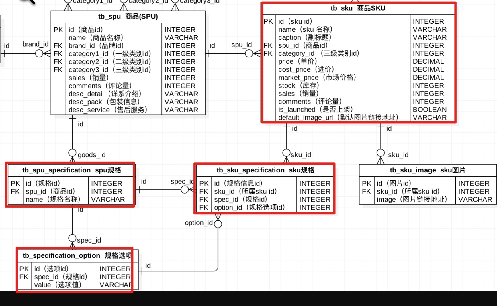

#### 1,修改地址

- 目的: 能够编写视图,处理修改地址的业务

- 操作流程:

  - 1, 编写子路由(users/urls.py)

    ```python
    url(r'^addresses/(?P<address_id>\d+)/$',
        views.AddressUpdateView.as_view()),
    ```

  - 2,修改地址(users/views.py)

    ```python
    class AddressUpdateView(MyLoginRequiredMiXinView):
        def put(self,request,address_id):
            #1,获取参数
            dict_data =  json.loads(request.body.decode())
            title = dict_data.get("title")
            receiver = dict_data.get("receiver")
            province_id = dict_data.get("province_id")
            city_id = dict_data.get("city_id")
            district_id = dict_data.get("district_id")
            place = dict_data.get("place")
            mobile = dict_data.get("mobile")
            tel = dict_data.get("tel")
            email = dict_data.get("email")
    
            #2,校验参数
            if not all([title,receiver,province_id,city_id,district_id,place,mobile,tel,email]):
                return http.HttpResponseForbidden("参数不全")
    
            #3,数据入库
            address = Address.objects.get(id=address_id)
            address.title = title
            address.receiver = receiver
            address.province_id = province_id
            address.city_id = city_id
            address.district_id = district_id
            address.place = place
            address.mobile = mobile
            address.tel = tel
            address.email = email
            address.save()
    
            #4,返回响应
            address_dict = {
                "id": address.id,
                "title": address.title,
                "receiver": address.receiver,
                "province": address.province.name,
                "city": address.city.name,
                "district": address.district.name,
                "place": address.place,
                "mobile": address.mobile,
                "tel": address.tel,
                "email": address.email,
            }
            return http.JsonResponse({"code":RET.OK,"address":address_dict})
    ```

    

#### 2,设置默认地址

- 目的: 能够修改用户的默认收货地址

- 操作流程:

  - 1, 路由(users/urls.py)

    ```python
    url(r'^addresses/(?P<address_id>\d+)/default/$',views.AddressDefaultView.as_view()),
    ```

    

  - 2,视图(usrs/views.py)

    ```python
    class AddressDefaultView(MyLoginRequiredMiXinView):
        def put(self,request,address_id):
            #1,入库
            request.user.default_address_id = address_id
            request.user.save()
    
            #2,返回
            return http.JsonResponse({"code":RET.OK})
    ```

    

#### 3,删除地址

- 目的: 能够修改地址的标记进行逻辑删除

- 操作流程:(users/views.py, users/urls.py)

  ```python
  class AddressUpdateView(MyLoginRequiredMiXinView):
      ...
      def delete(self,request,address_id):
  
          #1,获取地址对象
          address = Address.objects.get(id=address_id)
  
          #2,修改地址的is_deleted属性,入库
          address.is_deleted = True
          address.save()
          
          #3,返回响应
          return http.JsonResponse({"code":RET.OK})
  ```

  

#### 4,修改地址标题

- 目的: 能够编写视图修改地址标题

- 操作流程:

  - 1, 路由(users/urls.py)

    ```python
    url(r'^addresses/(?P<address_id>\d+)/title/$',views.AddressTitleView.as_view()),
    ```

  - 2,类视图(users/views.py)

    ```python
    class AddressTitleView(MyLoginRequiredMiXinView):
        def put(self,request,address_id):
    
            #1,获取参数
            title = json.loads(request.body.decode()).get("title")
    
            #2,为空校验参数
            if not title:
                return http.HttpResponseForbidden("参数不全")
    
            #3,数据入库
            ret = Address.objects.filter(id=address_id).update(title=title)
            if ret == 0:
                return http.HttpResponseForbidden("修改失败")
    
            #4,返回响应
            return http.JsonResponse({"code":RET.OK})
    ```

#### 5,区域缓存

- 目的: 能够使用系统提供的方法,设置缓存数据

- 操作流程:

  - 1, 缓存市的数据

    ```python
    class AreaView(View):
        def get(self,request):
            #1,获取参数area_id
            area_id = request.GET.get("area_id")
    
            #2,判断area_id是否有值
            if area_id: #(市,区)
    
                #TODO 获取市缓存信息
                sub_data = cache.get("sub_data_%s"%area_id)
    
                if sub_data:
                    context = {
                        "code": RET.OK,
                        "errmsg": "ok",
                        "sub_data":sub_data
                    }
                    return http.JsonResponse(context)
    
                ...
                
                #TODO 缓存市的信息
                cache.set("sub_data_%s"%area_id,context["sub_data"],3600*24*2)
    
                return http.JsonResponse(context)
    
            else:# (省)
    
                ...
    ```

    

  - 2, 缓存省的数据

    ```python
    class AreaView(View):
        def get(self,request):
           ...
            else:# (省)
    
                #TODO 获取缓存中的省信息
                areas_list = cache.get("province_list")
    
               ...
    
                #TODO 缓存省的信息
                cache.set('province_list',areas_list,3600*24*2)
    
                return http.JsonResponse(context)
    ```

    

#### 6,密码修改分析,页面获取

- 目的: 能够获取密码修改页面

- 操作流程:

  - 1, 路由(users/urls.py)

    ```python
    url(r'^password/$',views.PasswordChangeView.as_view()),
    ```

  - 2,类视图(users/views.py)
  
    ```python
    class PasswordChangeView(MyLoginRequiredMiXinView):
        def get(self,request):
            return render(request,'user_center_pass.html')
    ```
#### 7,密码修改

- 目的: 能够编写类视图修改用户密码

- 操作流程:

  - 1, 路由(users/urls.py)

    ```python
    url(r'^password/$',views.PasswordChangeView.as_view()),
    ```

  - 2,类视图(users/views.py)
  
    ```python
    class PasswordChangeView(MyLoginRequiredMiXinView):
        ...
    
        def post(self,request):
            #1,获取参数
            old_pwd = request.POST.get("old_pwd")
            new_pwd = request.POST.get("new_pwd")
            new_cpwd = request.POST.get("new_cpwd")
    
            #2,校验参数
            #2.1为空校验
            if not all([old_pwd,new_pwd,new_cpwd]):
                return http.HttpResponseForbidden("参数不全")
    
            #2,2校验密码格式
            if not re.match(r'^[0-9A-Za-z]{8,20}$',old_pwd):
                return http.HttpResponseForbidden("旧密码格式有误")
    
            if not re.match(r'^[0-9A-Za-z]{8,20}$',new_pwd):
                return http.HttpResponseForbidden("旧密码格式有误")
    
            #2.3旧密码正确性
            if not request.user.check_password(old_pwd):
                return http.HttpResponseForbidden("旧密码不正确")
    
            #2.4两次新密码正确性
            if new_pwd != new_cpwd:
                return http.HttpResponseForbidden("两次新密码不一致")
    
            #3,数据入库
            request.user.set_password(new_pwd)
            request.user.save()
    
            #4,返回响应,清空session信息
            logout(request)
            response = redirect('/login')
            response.delete_cookie("username")
            return response
    ```
#### 8,SPU&SKU

- 目的: 能够理解SPU,SKU的概念
  - SPU: 标准产品单位, 其实就是一个类
  - SKU: 标准库存量单位, 其实就是一个对象

#### 9,首页广告表分析

- 目的: 理解首页广告类别, 广告内容之间的关系


#### 10,商品表分类


#### 11,商品表sku


#### 12,商品表spu


#### 13,商品表规格



#### 14,首页,商品模型类,迁移