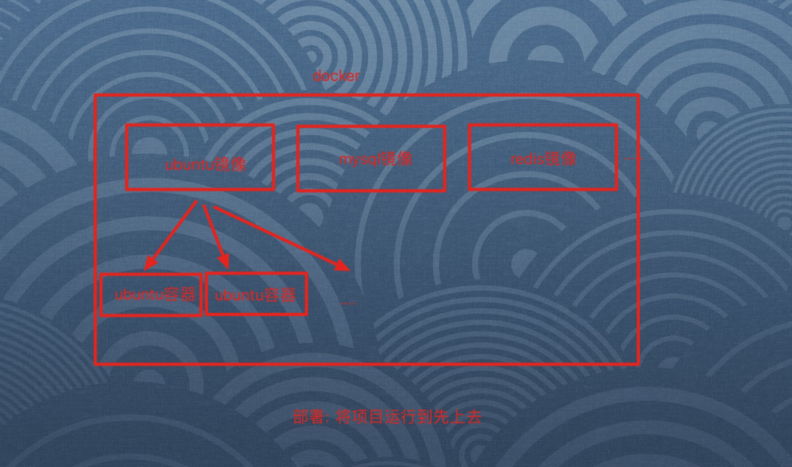

#### 1,FastDFS介绍

- 目的: 知道FASTDFS作用,以及组成

- 作用: 分布式的文件存储系统

- 作用: Tracker ,Storage

    

  

#### 2,Docker介绍

- 目的: 理解docker的作用和组成
  - 作用: 容器化技术
  - 组成: 镜像 + 容器
  - 特点:
    - 入门简单
    - 开发效率高
    - 可移植性强

		

#### 3,Docker安装(见文档)

- 目的: 能够参考文档,安装Docker

#### 4,Docker镜像(见文档)

- 目的: 能够对镜像进行增删改查

#### 5,Docker容器(见文档)

- 目的: 能够对镜像进行增删改查

#### 6,FastDFS安装

- 目的: 参考文档,安装storage,tracker容器和镜像
- 注意点:
  - tracker: 运行的端口是22122
  - storage: 运行的端口是8888

#### 7,图片存储测试

- 目的: 能够在终端中进行图片上传的测试

- 操作流程:

  - 1, 安装fdfs的客户端

    ```python
    $ pip install fdfs_client-py-master.zip
    $ pip install mutagen
    $ pip isntall requests
    ```

    

  - 2,创建fdfs包,拷贝client.conf配置文件(utils/fdfs/client.conf)

  - 3,在终端测试即可

    ```python
    
    In [1]: from fdfs_client.client import Fdfs_client                                                                                                                 
    
    In [2]: #1,创建对象                                                                                                                                                
    
    In [3]: client = Fdfs_client('/Users/heJing/Desktop/classes2/day07/meiduo12/meiduo_mall/meiduo_mall/utils/fdfs/client.conf')                                       
    
    In [4]: #2,上传                                                                                                                                                    
    
    In [5]: result = client.upload_by_filename('/Users/heJing/Desktop/上课资料2/day07/3_资料/07_图片素材/hello.jpeg')                                                  
    getting connection
    <fdfs_client.connection.Connection object at 0x10f530b00>
    <fdfs_client.fdfs_protol.Tracker_header object at 0x10f5309e8>
    
    In [6]: result                                                                                                                                                     
    Out[6]: 
    {'Group name': 'group1',
     'Remote file_id': 'group1/M00/00/02/rBAMhlzvmOCAA6hJAACdrkQkoKk26.jpeg',
     'Status': 'Upload successed.',
     'Local file name': '/Users/heJing/Desktop/上课资料2/day07/3_资料/07_图片素材/hello.jpeg',
     'Uploaded size': '39.00KB',
     'Storage IP': '172.16.12.134'}
    
    In [7]:        
    ```

    

#### 8,测试数据添加

- 目的: 能够将测试数据添加到数据库中

#### 9,首页商品分类

- 目的: 能够理解首页分类数据的查询和展示即可

- 操作流程:

- 1,  编写类视图组装数据(contenxt/views.py)

  ```python
  class IndexView(View):
      def get(self,request):
  
          #1,定义字典
          categories = {}
  
          #2,查询所有的频道组
          channels =  GoodsChannel.objects.order_by('group_id','sequence')
  
          #3,遍历频道组,组装数据
          for channel in channels:
  
              #3.1 取出组的编号
              group_id = channel.group_id
  
              #3.2组装好一个分类的字典
              if group_id not in categories:
                  categories[group_id] = {"channels":[],"sub_cats":[]}
  
              #3.3添加一级分类到channels
              catetory = channel.category
              catetory_dict = {
                  "id":catetory.id,
                  "name":catetory.name,
                  "url":channel.url
              }
              categories[group_id]["channels"].append(catetory_dict)
  
              #3.4添加二级分类三级分类
              for cat2 in catetory.subs.all():
                  categories[group_id]["sub_cats"].append(cat2)
  
          context = {
              "categories":categories,
              # "contents":"?"
          }
  
          return render(request,'index.html',context=context)
  ```

  

#### 10,首页商品广告

- 目的: 能够拼接数据,渲染前端页面

- 操作流程:

  - 1, 编写类视图代码(contens/views.py)

  ```python
  class IndexView(View):
      def get(self,request):
  				...
          
          #4,拼接广告数据
          contents = {}
          content_catetories = ContentCategory.objects.all()
          for content_catetory in content_catetories:
              contents[content_catetory.key] = content_catetory.content_set.order_by('sequence')
  
          #5,拼接数据,返回响应
          context = {
              "categories":categories,
              "contents":contents
          }
  
          return render(request,'index.html',context=context)
  ```

  - 2,替换index.html模板文件即可
